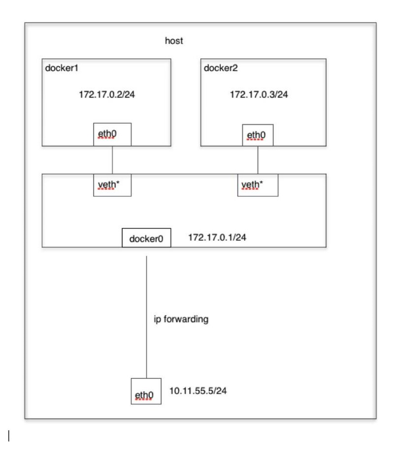
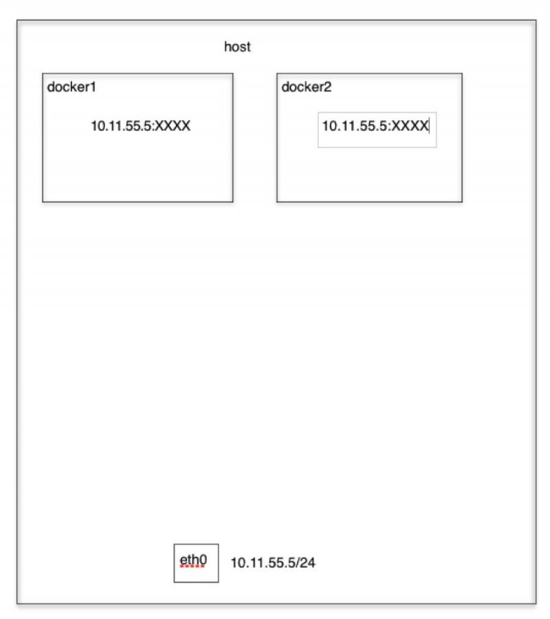
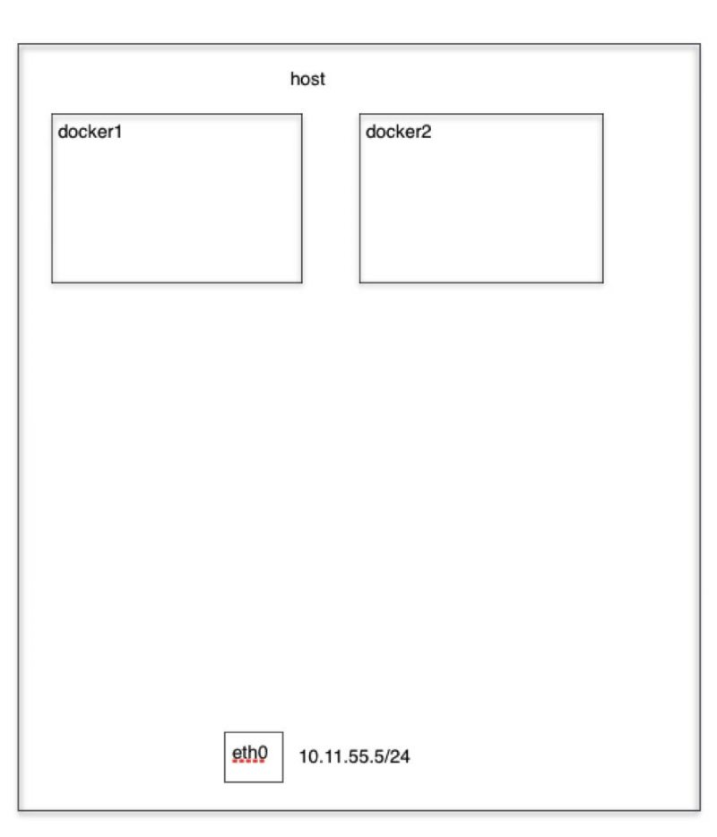

# 镜像和容器的区别：
	1. 镜像：不可以改变内容，理解成ios存在光盘中
	2. 容器：可以改变内容；
	3. 使用docker可以很方便的将镜像变成容器，也可以将容器封装成镜像。
# docker的优点：
	轻部署，节省成本，部署迁移方便

# docker 网络模式 
	docker有四种网络模式，Bridge模式、 Host模式 、Container模式、None模式
## Bridge模式
当Docker进程启动时，会在主机上创建一个名为docker0的虚拟网桥，此主机上启动的Docker容器会连接到这个虚拟网桥上。  

从docker0子网中分配一个IP给容器使用，并设置docker0的IP地址为容器的默认网关。在主机上创建一对虚拟网卡veth pair设备，Docker将veth pair设备的一

端放在新创建的容器中，并命名为eth0（容器的网卡），另一端放在主机中，以vethxxx这样类似的名字命名，并将这个网络设备加入到docker0网桥中。可以通

过brctl show命令查看。

## Host模式
如果启动容器的时候使用host模式，那么这个容器将不会获得一个独立的Network Namespace，而是和宿主机共用一个Network Namespace。容器将不会虚拟出自己的网卡，配置自己的IP等，而是使用宿主机的IP和端口。但是，容器的其他方面，如文件系统、进程列表等还是和宿主机隔离的。

## Container模式
这个模式指定新创建的容器和已经存在的一个容器共享一个 Network Namespace，而不是和宿主机共享。新创建的容器不会创建自己的网卡，配置自己的 IP，而是和一个指定的容器共享 IP、端口范围等。同样，两个容器除了网络方面，其他的如文件系统、进程列表等还是隔离的。两个容器的进程可以通过 lo 网卡设备通信。
## None模式
使用none模式，Docker容器拥有自己的Network Namespace，但是，并不为Docker容器进行任何网络配置。也就是说，这个Docker容器没有网卡、IP、路由等信息。需要我们自己为Docker容器添加网卡、配置IP等。就是这个模式下docker容器没有网卡

# 如何实现跨主机通信 (Back to Top)
	• Docker默认的网络环境下，单台主机上的Docker容器可以通过docker0网桥直接通信；
	• 不同主机上的Docker容器之间只能通过在主机上做端口映射进行通信。
Docker容器之间直接使用自己的IP地址进行通信。直接路由方式、桥接方式（如pipework）、Overlay隧道方式
