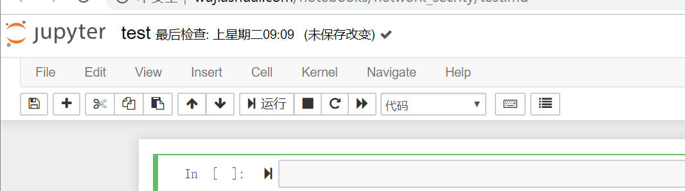
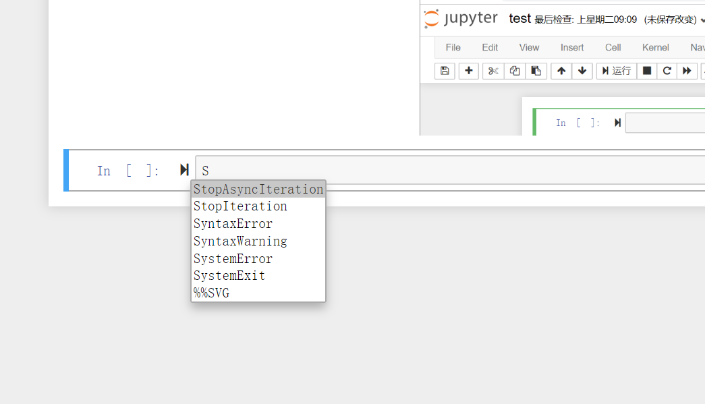

```{.python .input  n=2}
import math 
```

```{.python .input  n=3}
a=1+2
print(a)
```

```{.json .output n=3}
[
 {
  "name": "stdout",
  "output_type": "stream",
  "text": "3\n"
 }
]
```





## test

