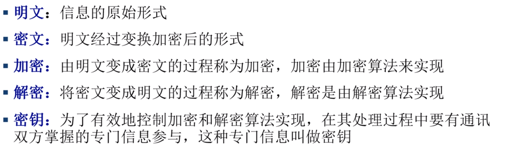
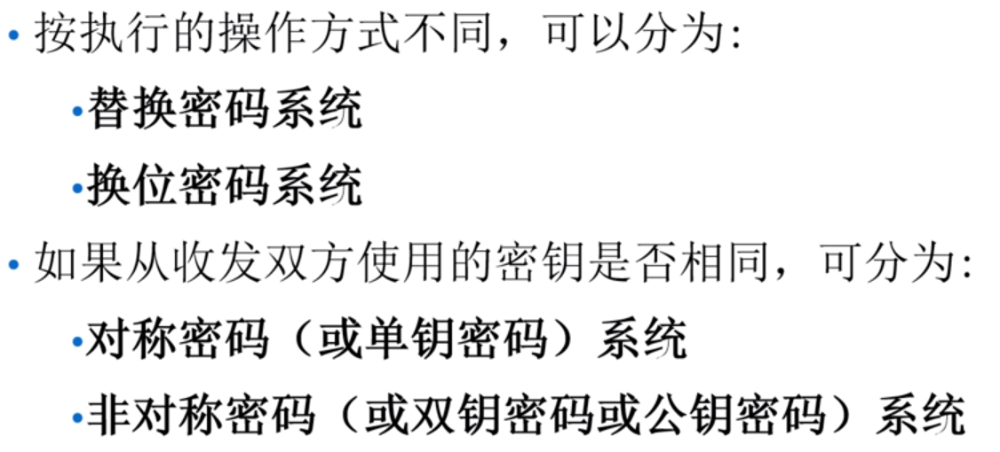
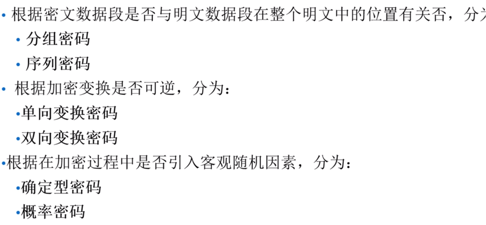
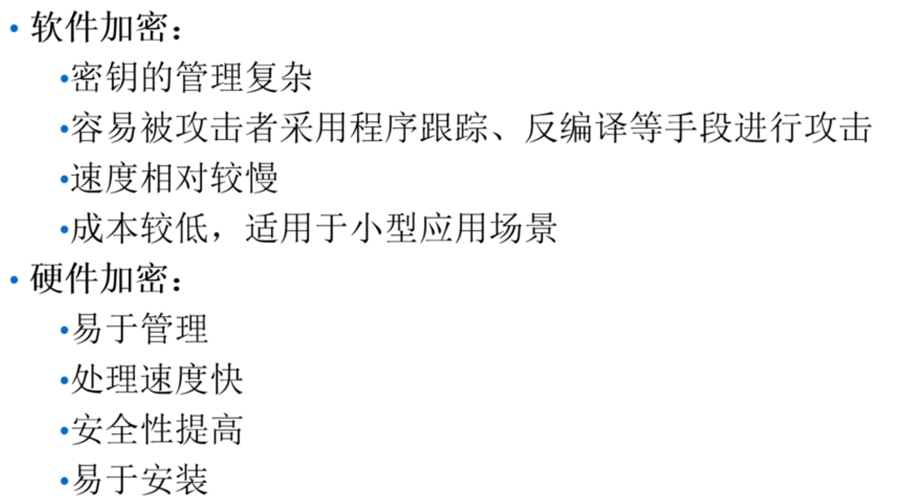
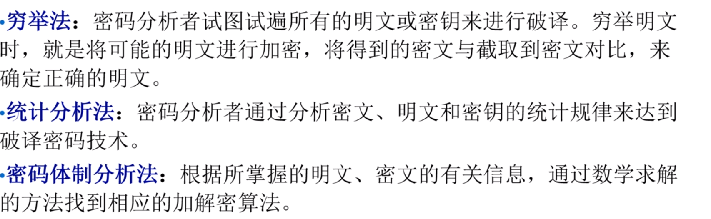
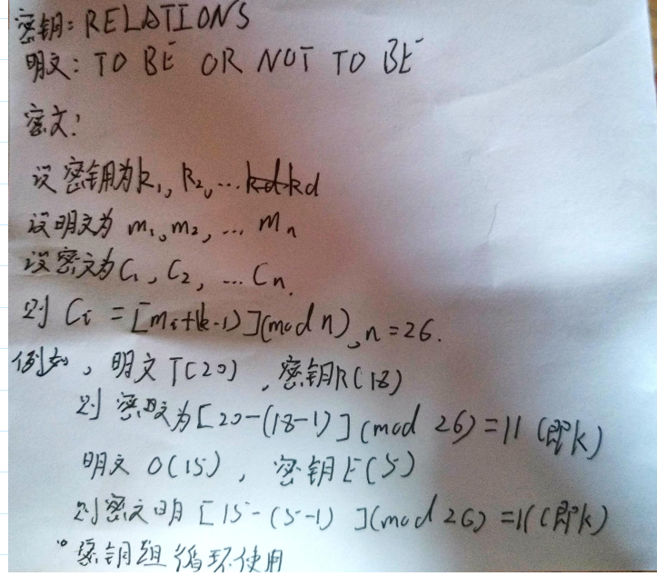
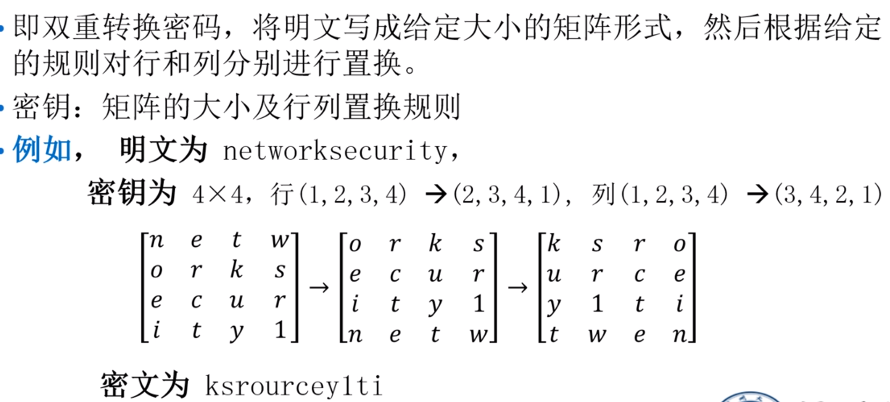

# 密码学分类
## 密码通讯系统

## 概念阐述

## 密码系统分类

## 数据加密实现

## 密码分析分类

### 古典密码技术
#### 替换密码技术
以符号的置换来实现掩盖明文信息  
1. 单字符单表密码，如凯撒密码。
    凯撒密码阐述，把明文中的所有字母都用它右边的第k个字母代替，F（x） = (a+k) mod n(a表示明文字母，n表示集中字母个数，k表示密钥)  
2. 单字符多表替换密码，如维吉尼亚密码，使用一个词组作为密钥。

			
#### 换位密码技术，
 对字符进行重新组合，并不会改变消息中的字符
    列换位密码：
   
