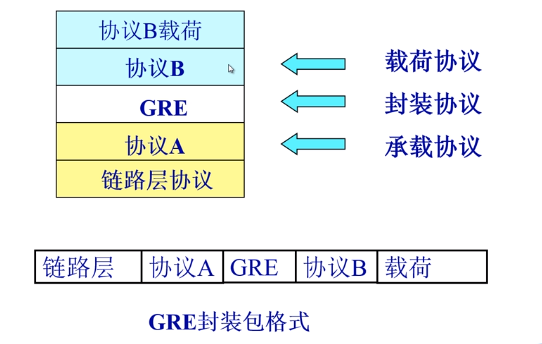
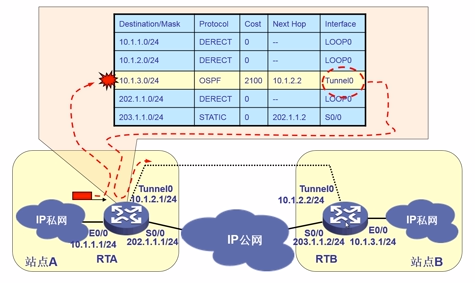

[toc]
# 网络传输安全
>虚拟Ⅴ irtua:利用公共网络建立逻辑上的专用数据通道,实现与专用数据通道相同的通信功能  
专用 Private:只有经过授权的用户才能使用,且传输的数据经过加密和认证
保密性和完整性:通过加密和报文摘要算法保证经过隧道传输的信息的保密性和完整性。  
双向身份鉴别:可以完成隧道两端之间双向身份鉴别过程,以此保证隧道两端或是将企业局域网接入互联网的边界路由器,或是远程终端和将内部网络接入互联网的边界路由器。   

## GRE VPN
通用路由封装协议，GRE是在任意一种网络协议上传送任意一种其它网络协议的封装方法。GRE VPN指的是直接使用GRE封装，在网络上传输其他协议
### GRE协议栈

#### GRE隧道处理流程
1. 隧道起点路由查找

我们在路由表中找到一条下一个接口是tunnel0的路由，所以我们就要启动GRE封装技术用来传递数据包在隧道中。
2. GRE封装数据报

```{.python .input}

```
