# 安全协议
## 网络安全协议概述
### 产生安全协议的原因
通信协议具有问题  
1. 源端鉴别问题
2. 数据传输的保密性问题 
3. 数据传输的完整性问题
4. 身份鉴别问题

### 网络安全协议所需要具有的功能
网络安全协议所需要具有的功能
1. 双向身份鉴别  

2. 数据加密  

3. 数据完整性检测  

4. 防重放攻击机制  

### 安全协议体系结构  

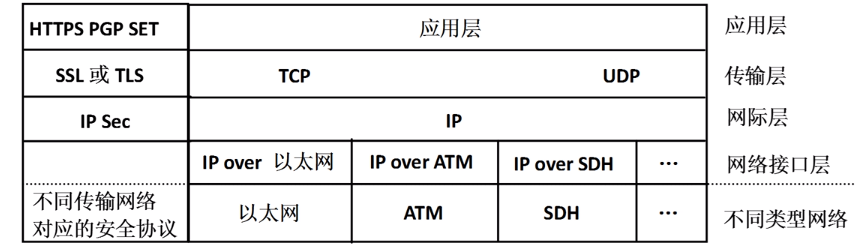

## 安全协议体系结构详细介绍

### IPsec协议
>IPSec是网际层实现IP分组端到端安全传输的机制,是以RFC形式公布的一组安全协议集,是在IP包级为IP业务提供保护的安全协议.IPSec将几种安全技术结合形成一个比较完整的安全体系结构.注意IP sec是安全协议集。将几种安全技术结合形成一个比较完整的安全体系结构。

IPSec提供了下面的安全服务:  
* 数据完整性
* 认证
   * 预共享认证
   * RSA数字签名认证  
* 保密性
* 应用透明的安全性

两种工作模式:传输模式和隧道模式  

#### IPsec重要协议  

安全通信协议(AH和ESP)  
* AH鉴别首部:认证+数据完整性检测  
* ESP封装安全载荷:认证+数据加密+数据完整性检测（AH/ESP协议的选择将决定其它组件）

密钥管理协议(IKE)  
用于在通信实体间创建安全关联,用于完成安全关联两端的双向身份鉴别过程以及安全关联相关参数的协商过。  

#### 安全关联  

为了实现数据发送者与接收者的安全传输,需要建立发送者与接收者之间的关联,这种以实现源端鉴别、数据加密和完整性检测为目的的关联称为安全关联(SA)安全关联是单向的,用于确定发送者至接收者传输方向的安全传输过程所使用的加密算法和加密密钥、消息鉴别码(MAC)算法和MAC密钥等安全关联唯一标识  
安全参数索引(SPI)+目的IP地址+安全协议标识符

#### 传输方式  

不改变原IP分组的IP头部，他是将要保护的数据作为上层协议数据这种模式下, IPSec所保护的数据就是作为IP分组净荷的上层协议数据,如TCP、UDP报文和其他基于IP的上层协议报文。  

#### 隧道模式
将整个IP分组作为另外一个载荷的IP分组上层协议，进行保护  

#### IPsec组成
  

值得注意的是选择AH与ESP的不同会导致下面选择的完全不同。会导致会不会选择加密算法，在整个传输过程中，如果采用AH算法则在传输过程中是以明文形式进行传输。  


Psk指的是预共享密钥
 
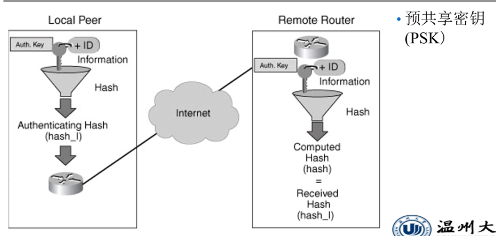  

RSA数字签名认证
 
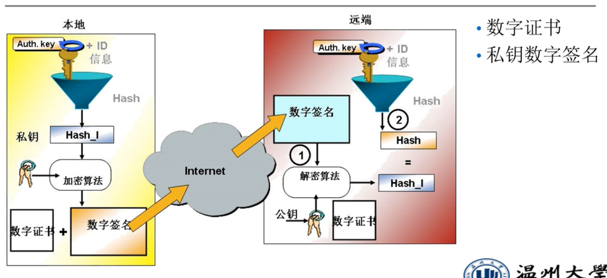  

#### IPsec的AH和ESP  
注意这里的AH和ESP是在整个传输过程中都要遵循的，而不单单只是在创建连接的时候进行。
认证头:所有数据都是明文的，提供认证（数字签名）和完整性（散列算法）的功能
 
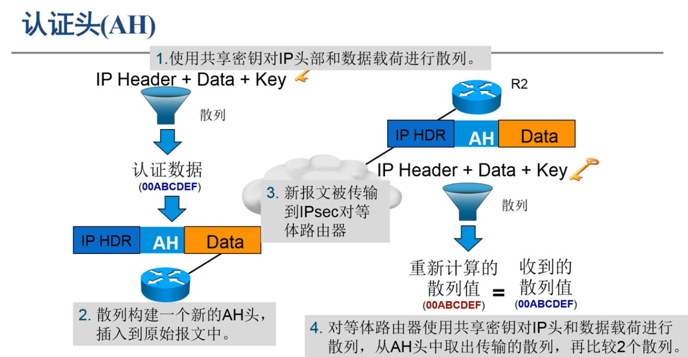
传输/隧道协议的认证头
 
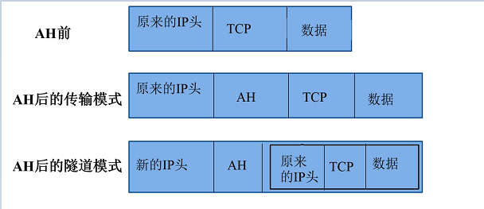
封装安全载荷：载荷数据是加密的，提供：加密、认证和完整性的功能。
 
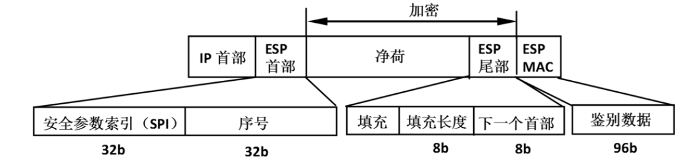
传输/隧道模式下封装的安全载荷
 
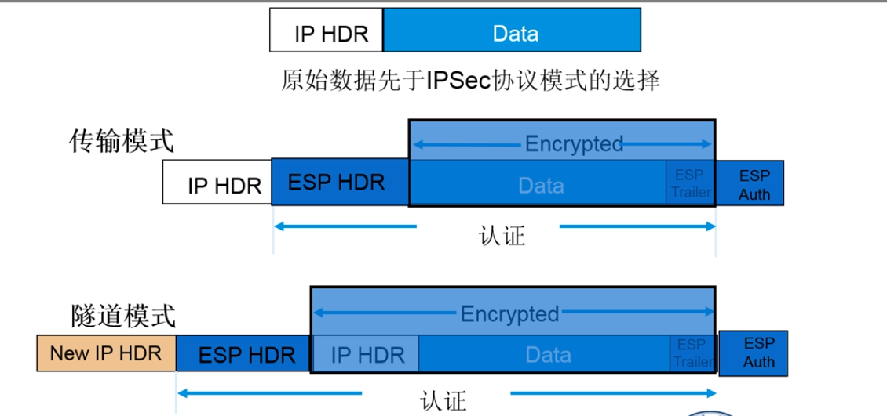  

####  IPsec的IKE协议  

IPsec在传送认证或加密的数据之前,必须就协议、加密算法和使用的密钥进行协商。而这个协商过程就是IKE协议
IKE实际上是三个协议ISAKMP、OAKLEY和、SKEME的混合体。使用的协议都是IPsec组成中的协议
* ISAKMP提供了认证和密钥交换的框架  
* OAKLEY描述了密钥交换的模式  
* SKEME定义了密钥交换技术  

IKE在作用就是在通信系统之间建立安全关联(SA),提供密钥确定、密钥管理的机制;IKE将密钥协商的结果保留在SA。  
 
#### IKE的启动过程  

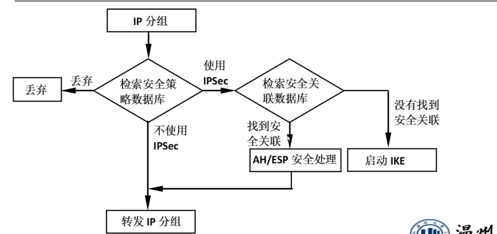  
由于SA( Security Association)是由一系列参数(如加密算法、密钥和  生命周期)定义的安全信道。所以建立SA的过程也就是参数的协商过程。而这些参数则是分为两部分，第一部分是两个终端已经存在的参数，比如加密方式，散列算法，密钥分发协议。而第二部分则是通过第一部分的参数产生的第二阶段
IKE建立sa的过程一共包括两个阶段  
SAKMP的第一个阶段( Main mode,MM)建立安全的传输通道  
* 协商和建立 ISAKMP SA,两个系统根据DH算法生成对称密钥,后续的KE通信都使用该密钥加密  
* 验证远程系统的标识(初始认证)  
SAKMP第二个阶段( Quick Mode,QM)建立安全关联:  
* 使用 IISAKMP/MM SA提供的安全信道协商一个或多个用于IPsec通信的SA  

IKE例子举例  
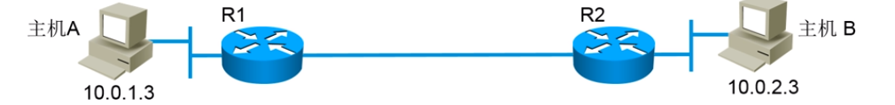  

建立传输通道
1. 协商IKE的安全策略集（如加密方式、DH算法、预共享密钥、散列算法等）
2. 使用前面协商出来的DH算法来交换密钥，交换之后双方就有了一个会话密钥
3. 通过会话密钥来加密鉴定数据（PSK、RSA数字签名认证）  

总的来说就是最后通过DH算法交换会话密钥。  

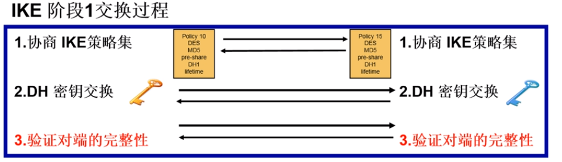  


协商IPsec策略（这是采用AH协议、或者是ESP协议、或者是AH+ESP协议）
第一阶段匹配的就是IKE策略，而匹配了IKE策略后就是到了第二阶段的匹配IPsec策略
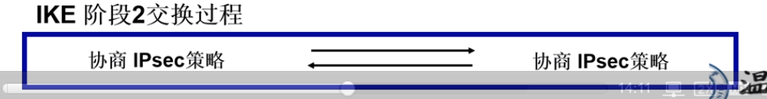  


所以我们可以通过上面的两个阶段得出sa的建立所依赖的参数就是IKE策略和IPsec策略。
### TLS协议
TLS是传输层安全协议，TLS提供的是TCP数据传输的安全保障。我们可以使用TLS记录协议来封装上层协议，然后再封装到TCP报文中，最后形成IP分组。  
TLS协议分类： 

上图中的四种TLS协议使用情景
1. 通过TLS握手协议完成双向身份鉴别过程,并约定压缩算法、加密算法、MAC算法、加密密钥、MAC密钥等安全参数。
2. 通信双方约定新的安全参数后,通过TLS改变密码规范协议通知对方开始使用新约定的安全参数
3. 通信报警协议用于传输出错消息,如解密失败、无法确认证书等。
4. 通过TLS记录协议来传输数据。  

#### TLS协议工作流程 
 
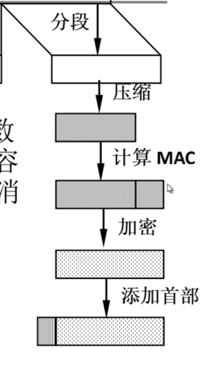
这个过程也就是将上层数据经过TLS后，直接加上TLS头部变成TCP的数据。  

#### TLS工作实例 

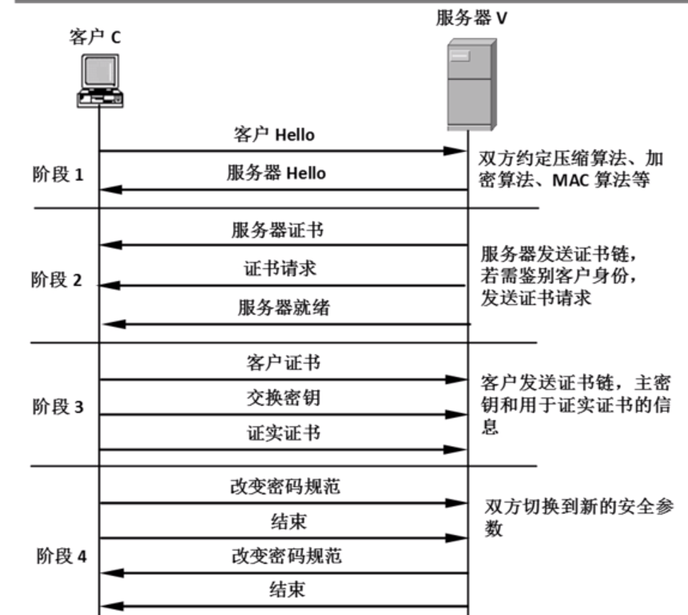  

#### 基于TLS的https协议
封装过程：HTTP --> TLS-->TCP-->IP
其中TLS加密数据的过程

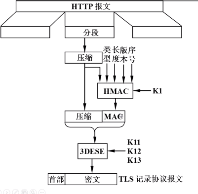
 
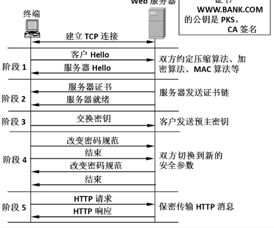  

### SET协议实现电子交易  


双重签名
 
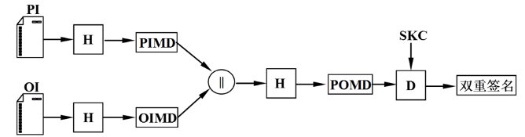
双重签名的作用  
对于持卡人来说：持卡人完成一次电子交易需要向商家列出购买的商品清单和支付凭证,而商家只能验证该支付凭证不能读取  
对于商家而言：双重签名的目的是将每一次电子交易涉及的支付信息和订货信息绑定,并证明这两组信息确实由持卡人给出。其中PI指的是支付信息，OI指的是订货信息
商家获得支付PIMD,再加上订货信息算出双重数字签名来验证  

支付网关获得OIMD,再加上支付信息算出双重数字签名来验证的

下面来讲一下电子交易过程，我们所谓的电子交易过程是持卡人在收到商家返回的订货信息后开始的  

1. 初始请求消息,包含持卡人拥有的信用卡类型、发卡机构请求标识和随机数(发送端封装),发送信用卡类型
2. 商家进行签名鉴别和数据完整性检测,再向持卡人发送初始响应消息:包括这次交易分配的交易标识符、商家和支付网关证书,以及匹配的请求标识和随机数。(认证+发送端封装），商家从请求报文中获取到行用卡类型，找到
3.  持卡人获得购物清单、本次交易金额、本次交易标识符、商家和支付网关证书后,构建支付信息和订货信息捆绑,封装购买请求消息。(双重签名+购买请求消息封装)
4. 商家鉴别购买请求消息,再处理订单,并向支付网关发送授权请求消息,以此来确认持卡人账户的有效性(鉴别+授权请求消息封装)
#### 封装发送信息
##### 持卡人封装发送信息


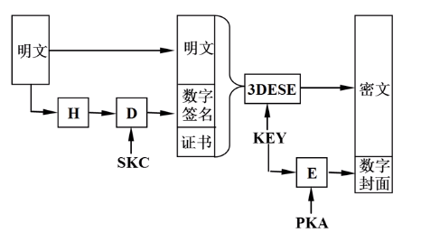  

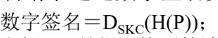  

其中SKC是发送者的私钥，H是报文摘要算法。PKA是商家的公钥.双方会话密钥通过PKA加密后生成数字封面
##### 商家封装发送信息  

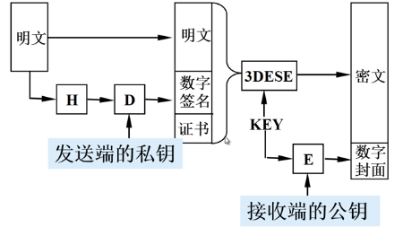  

#### 商家认证发送者身份和解密数据过程
 
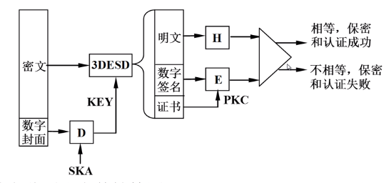  

其中SKA指的是商家的私钥，PKC指的是持卡人的公钥。在这里我们需要使用公钥来解密数字签名，从而获取到信息.

#### 购买请求消息封装过程  

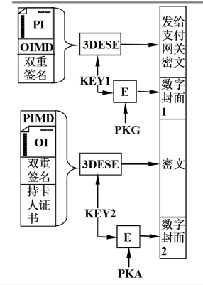  

PKA是商家的公钥，PKG指的是支付网关的公钥。最终生成的购买请求消息由持卡人发给商家，而购买请求中关于支付网关的部分将由商家转发给支付网关  

#### 商家鉴别购买请求消息
 
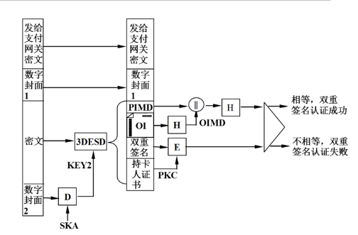

#### 商家封装授权请求消息
 
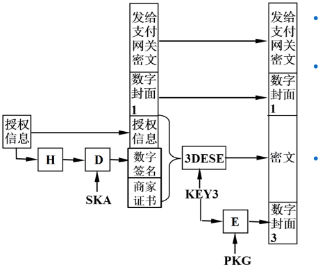  

PKG指的是支付网关的公钥,SKA指的是商家的私钥

#### 支付网关验证授权请求消息  

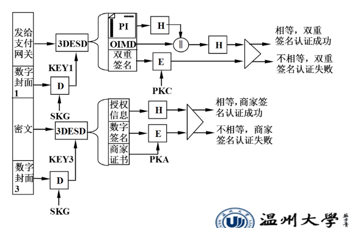  


#### 商家请求支付请求消息  

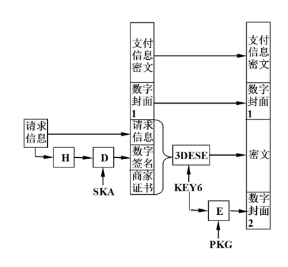

```{.python .input}

```
