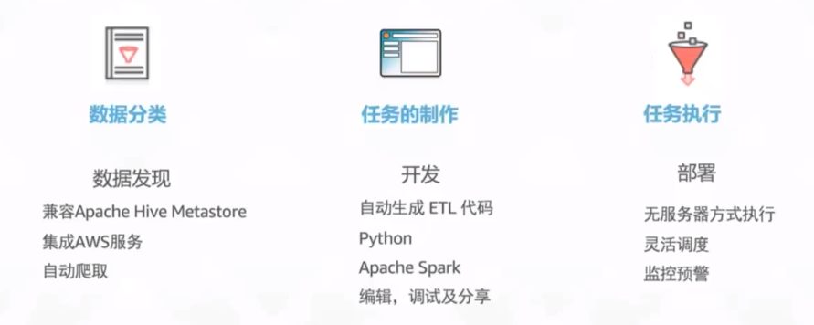

## 概述  
数据胡拓展传统分析方法

数据胡拓展传统分析方法

数据湖处理流程

1. 将不同数据源,存储到S3存储桶。
2. 由于来自于不同的数据源，导致数据的特性不一样，所以我们需要使用glue。当数据存储到对象存储中，会自动从对象存储中爬取数据。这个爬取的前提就是出发事件。
3. glue对数据进行分析变成表，放入GLUE DATA CATALOG。对数据结构进行分析。数据还是存储在S3存储桶中

AWS GLUE服务

