## 存储分类
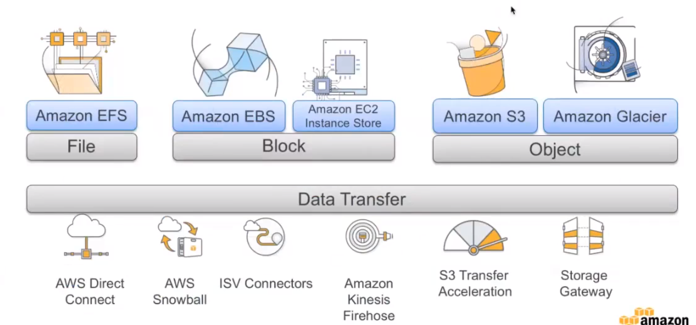
1. EFS 文件存储
2. EBS块存储
3. S3对象存储

### 对象存储——S3
#### demo——静态网页
1. 创建存储桶
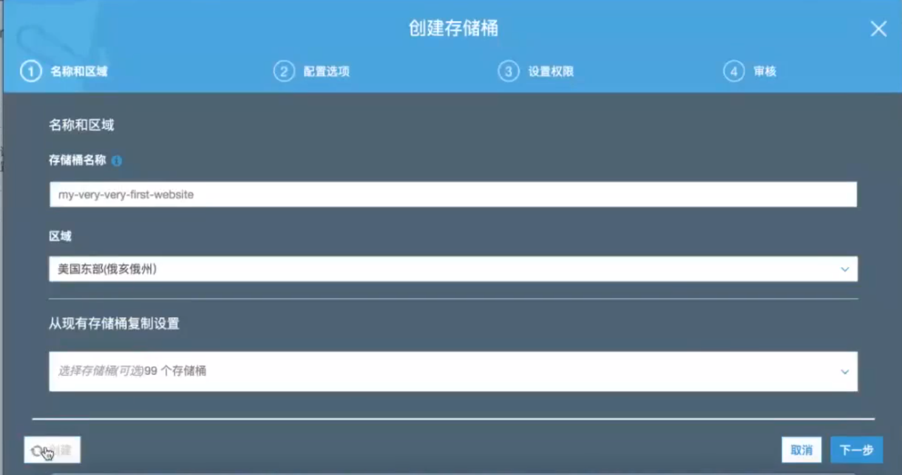

2. 设置存储桶属性
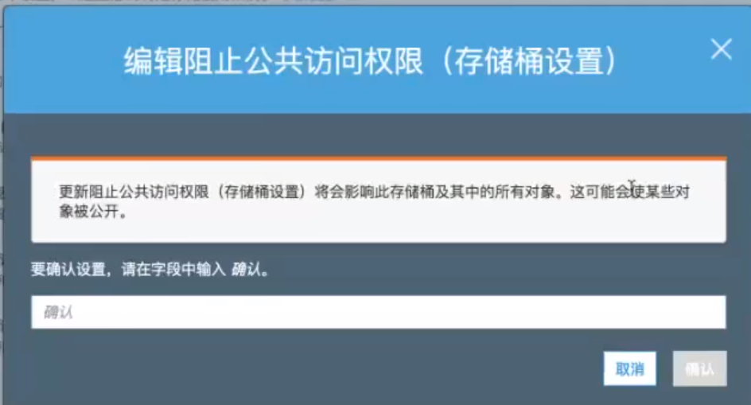

3. 选择静态网站托管
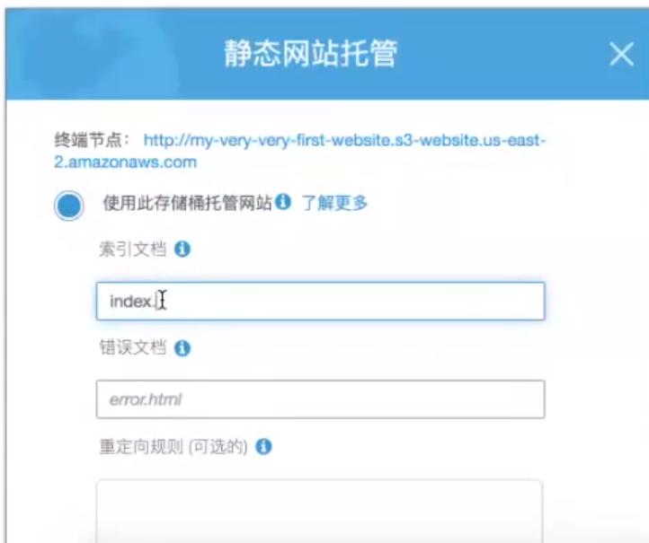

4. 上传文件
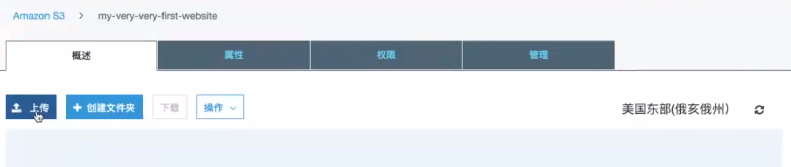

5. 写存储桶策略
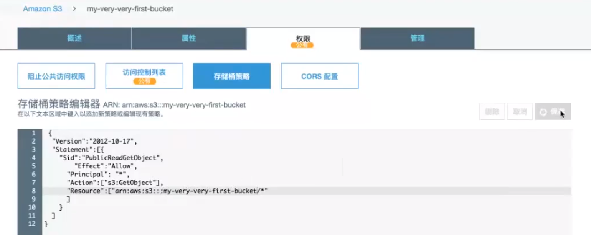

### S3的存储的分类
S3存储分为3种，标准S3，Infrequent Access,Amazon Glacier。其中Infrequent Access自动选择将数据放入标准S3还是冰川S3
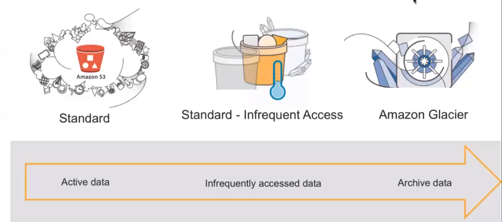
S3可以和Lambda一起使用，即S3发生了改变，可以使用对应的事件。三种S3的存储使用情况：  
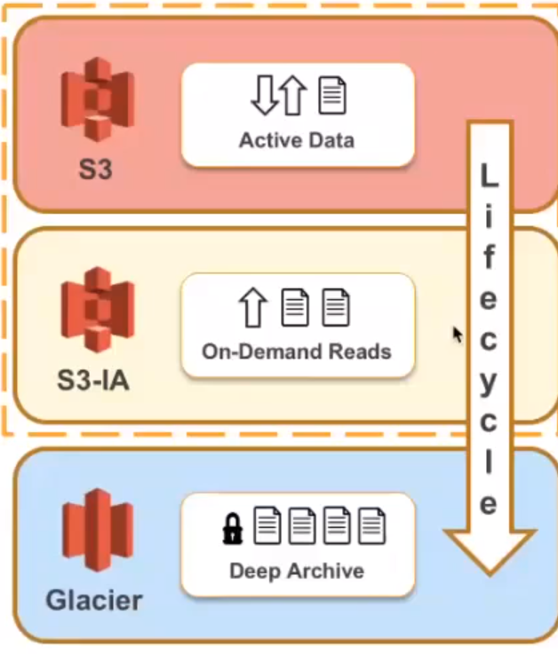

#### demo——使用GLUE和Athena创建数据湖
1. 创建存储桶
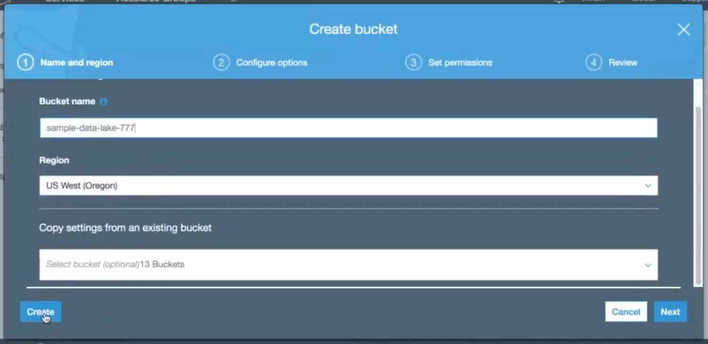

2. 上传文件
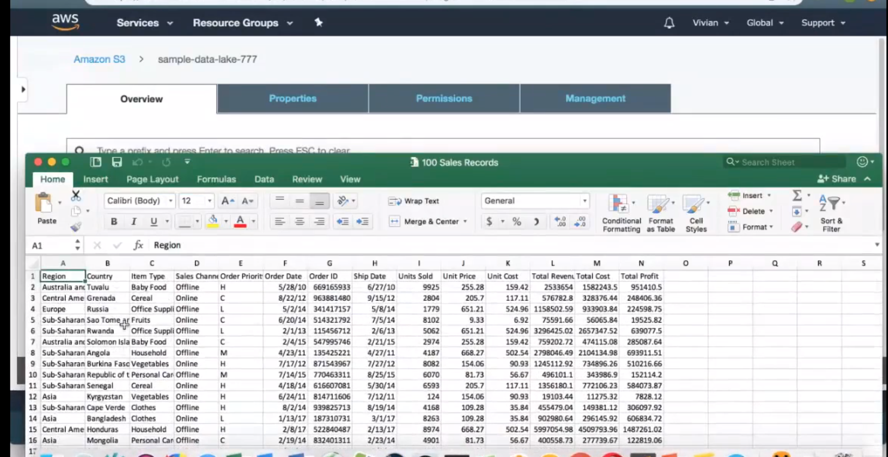

3. 创建一个IAM的Role
让role具备S3的访问权限以及GLUE的权限。即通过规则将S3和GLUE的权限联系起来。
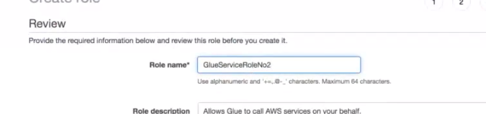

4. 使用glue服务
创建数据库
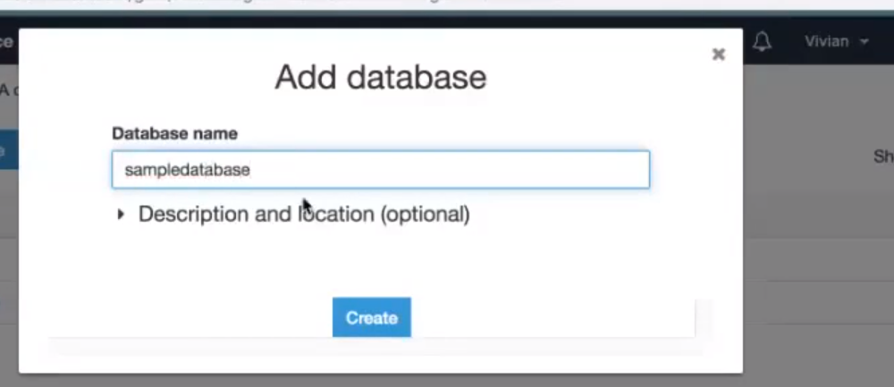
使用爬虫来向GLUE中添加table
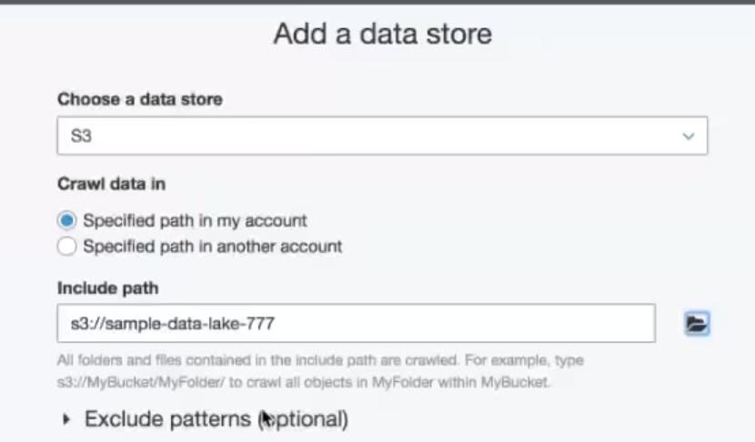
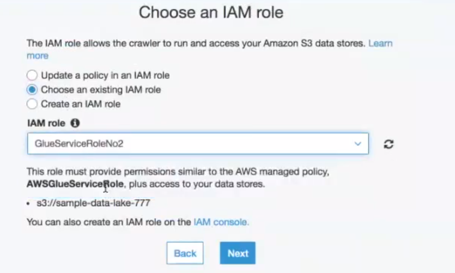
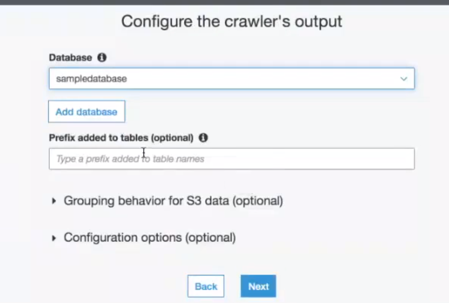

## EC2
>EC2类似一个小的linux系统的docker实例，其中的镜像是从AMI种获取。

这个是云计算计算服务（有CPU和GPU计算资源），是一个虚拟机服务

