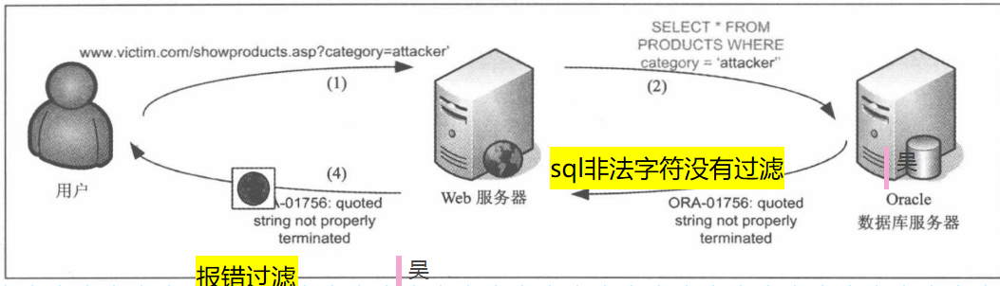

## sql注入测试的目的  

查找可疑注入点集合，确定可用注入点

## sql注入点可能存在的地方  

只要与数据库发生了交互，就可能出现注入点，比如get请求、post请求、cookie和http报文的头部信息，以及DNS查询都可以出现  
    
## 进行推理测试注入点  
+ 识别数据输入
    查看那些输入点可能会产生注入点
+ 操纵参数
    构建参数，来尝试是否会产生注入点
+ 信息工作流
    查看服务器给出的响应
### 思考问题
为什么会有数据库报错显示到页面?   
web服务器只负责创建SQL查询，解析结果，将结果显示给用户。将数据库产生的错误直接打印到前端，是由于两个原因:
+ 没有进行过滤——sql非法字符过滤
+ 没有进行过滤——报错过滤
  

## 常见的SQL错误
### SQL Server错误
1. 将一个单引号插入到参数中会产生数据库错误。
2. 应该是数值形的，却输入字符。会导致数据库，认为字符是列名
3. 转换类型失败，暴露变量内容：如0/@@version。中@@version是MSSQL的全局变量，0/@@versio .类型转换失败，所以就将@@versio数据库信息暴露出来。
4. 显示数据库执行的语句的信息
5. 使用Group By来枚举select语句中的所有列  

### Mysql 错误
1. 将一个单引号插入到参数中会产生数据库错误。
+ 应该是数值形的，却输入字符。会导致数据库，认为字符是列名。  

### Oracle错误
1. 将一个单引号插入到参数中会产生数据库错误。  
2. 应用程序的响应  
    + 我们可以通过用户分析，输入分析web/应用程序的响应
        1. 常见错误  
        返回默认服务器的出错页面，这个是不会将数据库的报错暴露在网页上的  
        2. HTTP状态码异常  
        返回不寻常的http状态码，比如302和500.收到302或者500是个好事情，说明我们已经以某种方式干预了程序的正常运行
