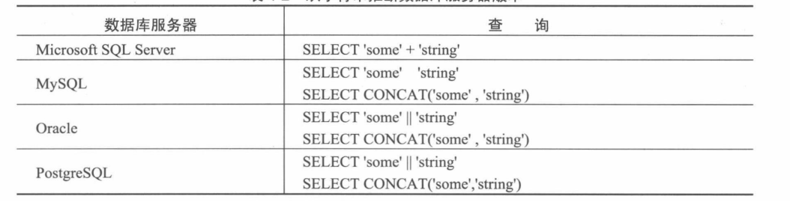
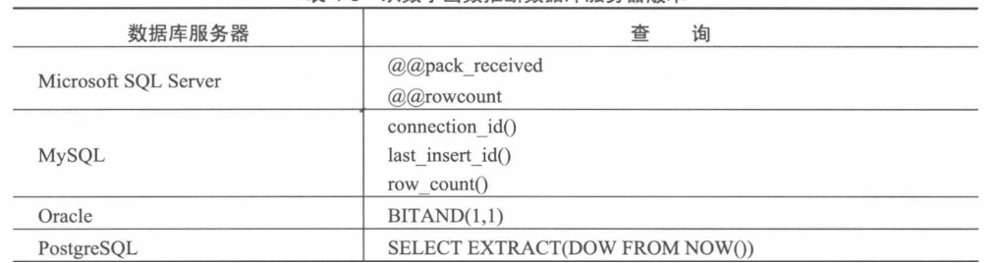

## 非盲获取
### 通过报错获取数据库类型
我们可以通过构造错误的sql语句从而获取显示在页面上的数据库报错。我们从这些报错中可以获取到数据库信息。  

### 通过特定的sql变量获取到数据库信息

数据库服务器类型|查询变量
----------------|--------
Sql Server|SELECT @@version
MYSQL | SELECT version()<br> SELECT @@version 
Oracle | SELECT banner FROM $version <br> SELECT bannr FROM $version WHERE rownum=1
Postgre|SQLSELECT version()  

这些变量中包含了丰富的信息，除了数据库服务器的精确版本还补丁级别，还包括了数据库安装于其上额度操作系统的信息。
**我们知道这些有什么用？比如我们知道了补丁，就可以知道他有没有补上某个漏洞**  

### SQL server 的其他内置变量

变量|含义
---|---
@@versio|据库服务器版本
@@servername|装Sql server服务器的名称
@@language|前所使用的语言的名称
@@spid|前用户的进程id

## 盲查询  
在盲查询中，我们无法获取到数据库的响应，即无法使用数据库内置变量。我们可以通过数据库之间微小的差别来判断数据库类别。
### 从字符串来判断数据库类别  


### 从数字函数判断数据库类别



### 使用每个sql专属的特殊结构SQL server

1. SQL server
    成功地注入WAITFOR DELAY
2. PostgreSQL
    成功注入SELECT pg_sleep(10)
3. Mysql
    在一个“/*”序列后再跟一个“*／”序列，位于两者之间的即为注释.如果注释开头的部分添加感叹号，并在后面跟上数据库的版本编号，只要安装的数据库版本高于或者等于注释中的版本编号，那么该注释将会被解析成代码。如：

```sql
SELECT 1 /*!40119+1*/
```


Mysql 将会返回2这个结果，而其他数据库只会返回1。
