>前面介绍了多种不同的从远程数据库提取数据的技术。为说明这些技术，我们只检索了少量信息。现在我们要进一步拓宽视野，学习如何使用这些技术来获取大量数据。毕竟数据库是可以包含几太字节（万亿字节）数据的庞然大物。要想实施成功的攻击并正确评估SQL注入漏洞所带来的风险，只执行跟踪并提取一些信息位是不够的：老练且足智多谋的攻击者完全能够枚举数据库中的所有表并且能快速提取出想要的内容。所以如何快速获取到大量数据，就是通过访问特殊的表
以下四种数据库系统都有一个特殊的数据库中有着一些整体数据

## Sql server 快速提取
1. 获取其他数据库的名称  
master..sysdatabases数据库中存储着其他数据库的一些信息
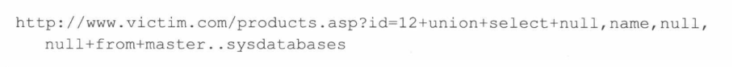
作用：返回其他数据库的名称  
2. 获取数据库中数据表的名称  
枚举某个数据库所包含的表。每个数据库都有一张名为sysobjects的表，其中刚好包含了数据表的信息，比如列名。当然，其中也包含了很多我们不需要的数据，所以我们需要通过指定自己感兴趣的行（类型为U）来关注用户定义的对  
3. 获取表中的数据  
上面已经获取到了数据库中的数据表的列信息，所以我们可以直接使用union来获取对应的数据  

## Mysql 快速获取
1. 获取数据库的名称  
information_schema.SCHEMATA  
提供了当前mysql实例中所有数据库的信息。是show databases的结果取之此表
```sql
select * from information_schema.SCHEMATA;
```
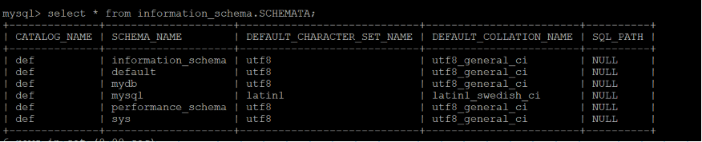  
2. 获取数据库中表的信息  
information_schema.TABLES中存放着mysql所有的数据表  
```sql
select TABLE_SCHEMA,TABLE_NAME,TABLE_TYPE,ROW_FORMAT,TABLE_ROWS,AVG_ROW_LENGTH  from information_schema.TABLES
```
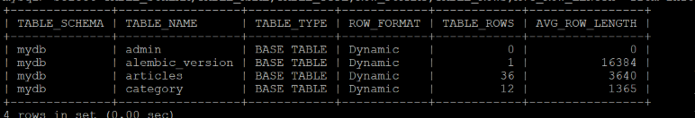  
3. 获取数据库中列的信息
information_schema.COLUMNS表：提供了表中的列信息。详细表述了某张表的所有列以及每个列的信息
```sql
select * from  information_schema.COLUMNS;
```
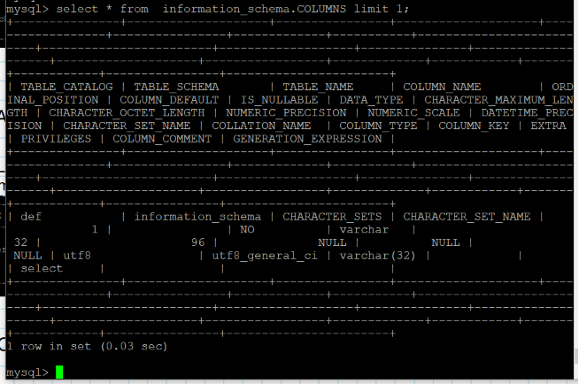
4. 获得数据库中的用户权限
information_schema.USER_PRIVILEGES
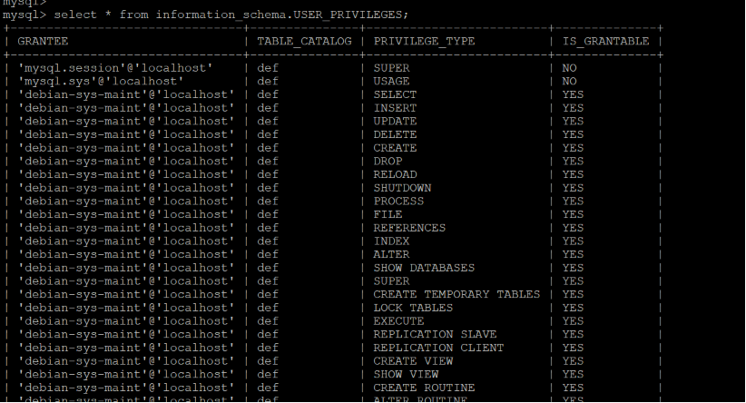  
5. 查看数据库中的所有用户
mysql.user
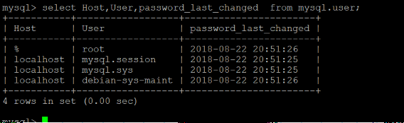


## PostgreSQL 数据库快速获取  

1. 列出所有数据库
```sql
SELECT datname FROM pg_database
```
3. 获取当前是哪一个数据库
```sql
SELECT current_database()
```
3. 返回数据库的完整用户列表
```sql
SELECT usename
```
4. 获取当前用户
```sql
SELECT user；
SELECT current_user；
SELECT session_user；
SELECT getpgusername()；
```
5. 获取数据库中的所有表
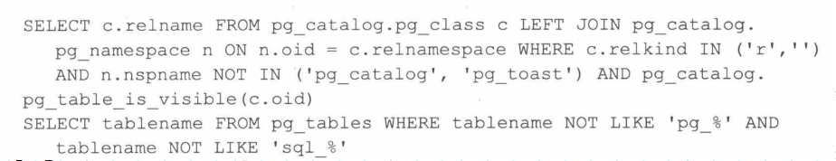
提取所有列的一个列表
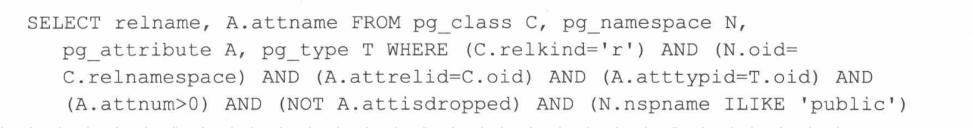
上面的查询语句将提取public模式中所有的列。如果需要提取其他模式中的所有列，只须
修改最后一个ILIKE子句即可。
对于我们感兴趣的列（常见的例子有password和passwd列），如果想找到包含这些列的表，可以使用下面的查询，请根据需要修改最后一个LIKE子句：
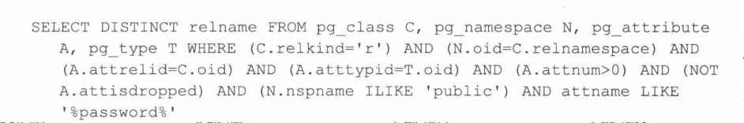  
我们还可以从这个网址获得其他查询
http：//pentestmonkey.net/cheat-sheets


## Oracle数据库快速查询
Oracle数据库的奇特地方在于一次只能访问一个数据库，所以每次你只能获取到一个数据库中的信息。
查询属于当前用户的所有表

查看当前数据库中的所有表以及其所有者

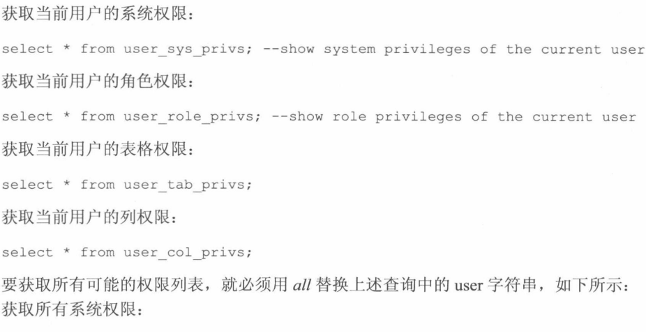
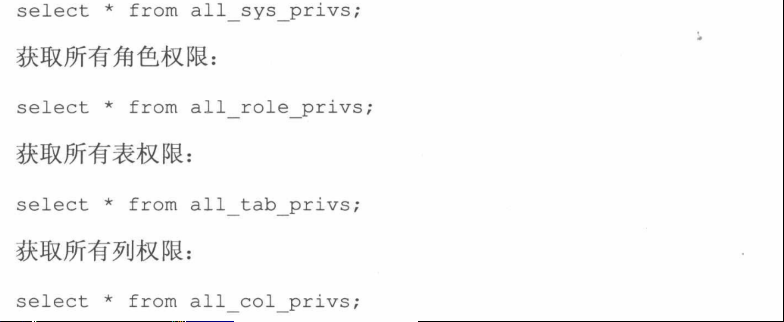
枚举数据库中的所有用户
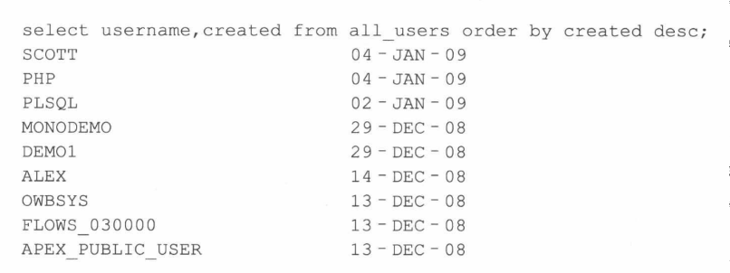
检索数据库的用户名和哈希口令
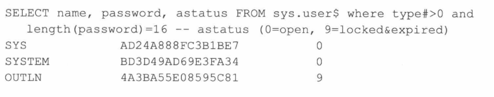
查询有哪些OBA用户

