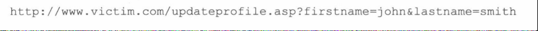

## INSERT插入生效
策略就是关闭作为列值传入的字符串，然后精心构造SQL代码。
假定我们正在提交一个firstname和一个lastname，而firstname是一个容易受到攻击的。
原始url如下

隐藏sql语句为

我们可以修改隐藏sql语句为

接下来会发生以下情况


最终我的个人信息 lastname这里就会填上

也就是我将密码的hash放在离这里
假定，我以相同的方法去修改坚果云的新的当前密码，

那么最后坚果云的后台数据库就会显示在我这登陆密码这里
  

## INSERT插入失效
这个也是一样，构造一条sql语句，但是是不是感觉很好奇，insert插入失败不是代表sql语句有问题，而为什么又能够查询成功？
所以我们要构造一个具有两个嵌套查询的select查询，以便内部查询用于提取消息，而外部查询确保执行失败，这样就可以成功的提取数据而同时又保证插入失败


```{.python .input}

```
