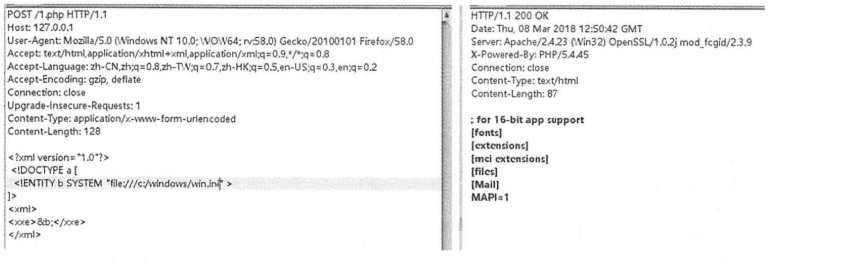

>XML注入又称XXE，全称为XML External Entity即外部实体注入攻击XML用于标记电子 文件使其具有结构性的标记语言，可以用来标记数据、定义数据类型，是一种允许 用户对自己的标记语言进行定义的源语言。 


## 常见的XML语法结构


介绍：
1. 内部声明DTD格式： ＜ ！ DOCTYPE 根元素［元素声明］＞ 。
2. 引用外部DTD格式： ＜!DOCTYPE 根元素 SYSTEM ”文件名”＞。
在DTD中进行实体声明时，将使用ENTITY关键字来声明。实体是用于定义引用 普通文本或特殊字符的快捷方式的变量。实体可在内部或外部进行声明 。
3. 内部声明实体格式： ＜!ENTITY 实体名称”实体的值”＞。
4. 引用外部实体格式： ＜!ENTITY 实体名称 SYSTEM ’U阳”＞。

## XML注入攻击举例
HTTP请求的POST参数如下所示：
参数含义：在POST参数中， 关键语句为“自le///C:/windows/win. ini 飞 该语旬的作用是通过fi le 协议读取本地文件C :/windows/win.ini 。

抓包查看


```{.python .input}

```
