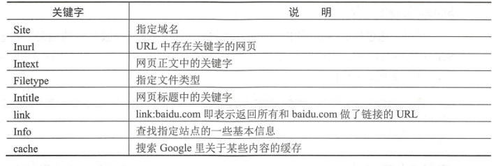
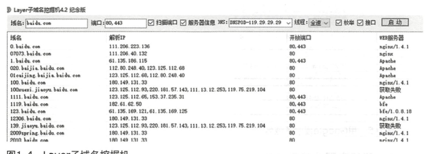
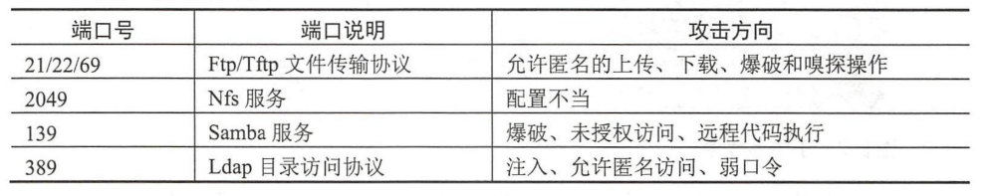
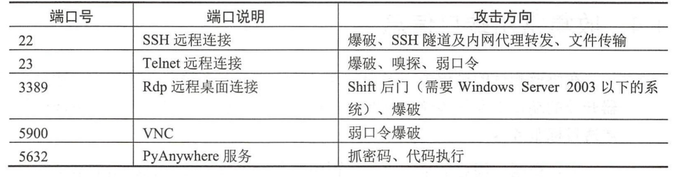
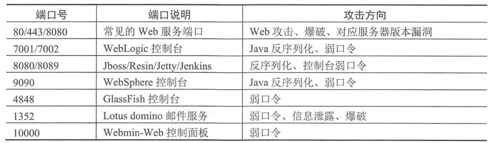
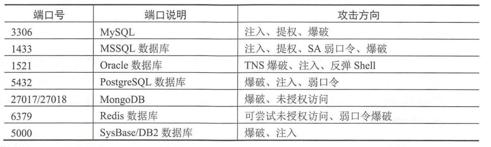
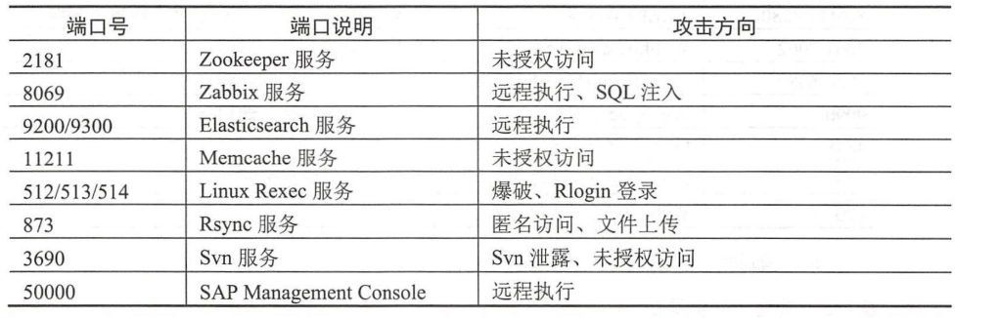
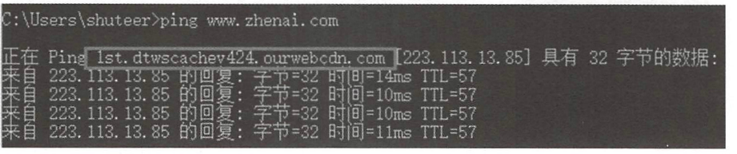

# 收集域名信息
获取到域名后，就是需要获取域名的相关信息：


1. 
2.
3.

## 收集方式
### 域名信息收集
#### whois
whois 是一个标准的互联网协议，可用于收集网络注册信息，注册的域名、 IP地址等信息。  
1. 在kali中可以直接使用
```shell
whois www.baidu.com
```
来获取相关信息
2. 在线查询方式  
在线查询方式的网址一般有在线Whois查询的常用网站有  [爱站工具网](https://whois.aizhan.com)、[站长之家](http://whois.chinaz.com)和[VirusTotal](https://www.virustotal.com)
#### 备案信息查询
国内的域名一定要在相关部门进行备案，可以在以下网址查询
1. ICP备案查询网： http://www.beianbeian.com 
2. 天眼查： http://www.tianyancha.com

## 收集敏感信息

1. 使用搜索引擎，如Google



## 收集子域名信息
1. 使用工具  
Layer子域名挖掘机、 Sublist3r和subDomainsBrute 。  
Layer是图形化界面如下

subDomainsBrute 
其的特点是可以用小字典递归地发现三级域名、四级域名,甚至
五级域名等不容易被探测到的域名，使用方法  

```shell
python subDomainsbrute.py xxxx.com
```
2. 使用搜索引擎  
使用语法
```
site:baidu.com
```
3. 使用第三方网站  
DNSdumpster网站（https://:11dnsdumpster.com/）
4. 使用CA下的证书透明度项目
https://crt.sh 和censys: https://censys.io .


## 收集常用端口信息
1. namp
2. 御剑高速TCP端口扫描工具

### 端口的常见用途
1. 文件传输协议


2. 远程连接服务端口


3. web服务端口


4. 数据库服务端口


5. 特殊端口


## 查询真实IP

一般情况下，一个域名就可以直接获取到真实的ip，但如果使用了cdn，那么就不能直接通过域名获取到真实的ip，如何绕过cdn。
### 判断是否使用了cdn技术
1. 本地ping

查看返回的是否是IP
2. 在线ping，判断ping获取到的ip是否一致。17CE网站
 https://www.17ce.com
 
 ### 绕过cdn
 1. 查询域名的解析记录
 目标很久以前并没有用过CDN，可以使用网址[NETCRAFT](https://www.netcraft.com/)查询
 2. 从网站的app端入手
 3. 

```{.python .input}

```
