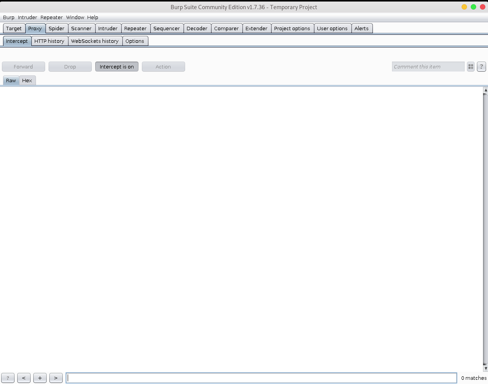
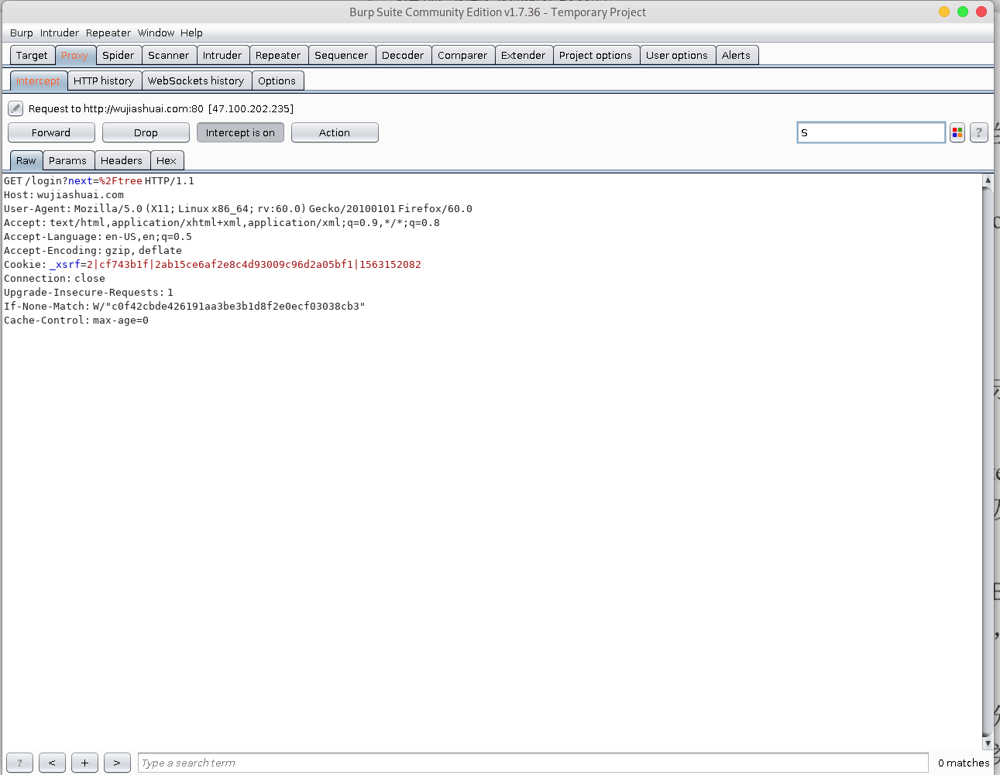

>Burp Suites这个工具是代理服务器工具，所以我们肯定要在web上设置代理。这样才能使用这个软件进行流量截取
## 界面

下面依次介绍常见组件
## Proxy

1. Forward表示将拦截的数据包或修改后的数据包发送至服务器端 。
2. Drop表示丢弃当前拦截 的 数据包 。
3. Interception is on表示开启拦截功能,单击后变为 Interception is off,表示关闭 拦截功能 。
4. 单击Action按钮,可 以 将数据包进一步发送到 Spider 、 Scanner 、 Repeater 、Intruder等功能组件做进一步的 测 试,同时 也包含改变数据包请求方 式及其body 的编码等功能 。

