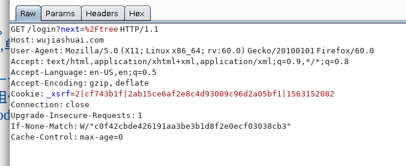
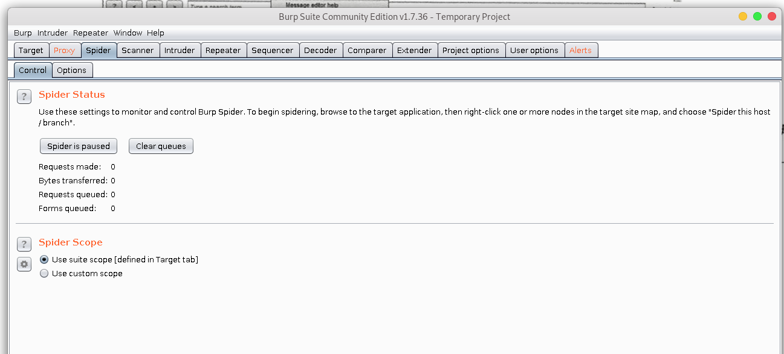

>Burp Suites这个工具是代理服务器工具，所以我们肯定要在web上设置代理。这样才能使用这个软件进行流量截取
## 界面  


下面依次介绍常见组件
## Proxy  


1. Forward表示将拦截的数据包或修改后的数据包发送至服务器端 。
2.  Drop表示丢弃当前拦截 的 数据包 。
3.  Interception is on表示开启拦截功能,单击后变为 Interception is off,表示关闭 拦截功能 。
4.  单击Action按钮,可 以 将数据包进一步发送到 Spider 、 Scanner 、 Repeater 、Intruder等功能组件做进一步的 测 试,同时 也包含改变数据包请求方 式及其body 的编码等功能 。  

http报文介绍


1. raw 就是一个原始的http报文
2. Params 显示客户端请 求的 参数信息, 包括 GET或者POST请 求的 参数 、cookie参数。
3. Headers 中 显示 的 是数据包中的 头信息,以 名称、值的形式显示数据包 。
4. Hex对应 的 是Raw 中信息的二进制内容 , 可以通过Hex编辑器对请求 的 内容进行修改, 在进行 00截 断时非常好用


## Spider部分



## Scanner部分
>Burp Scanner用于自动检测web系统的各种漏洞.
这篇博客有比较详细的介绍

[BurpSuite Scanner组件使用说明](https://blog.csdn.net/yoyo328/article/details/77822887)
比较好奇的是==,这块不怎么懂.书里面回头看

```{.python .input}

```
