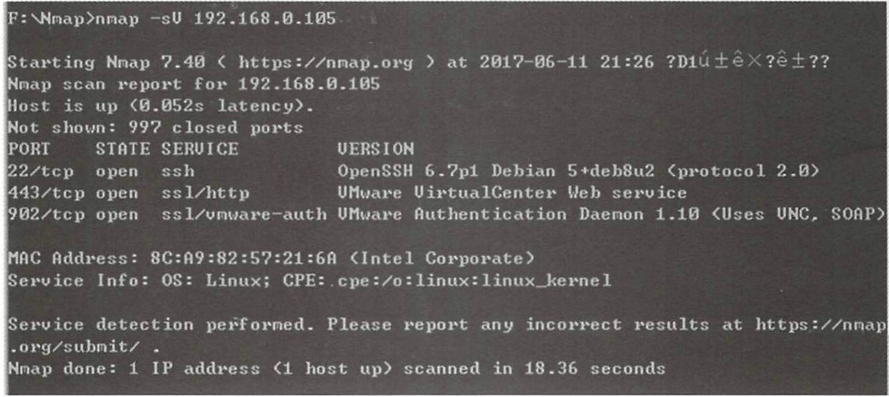
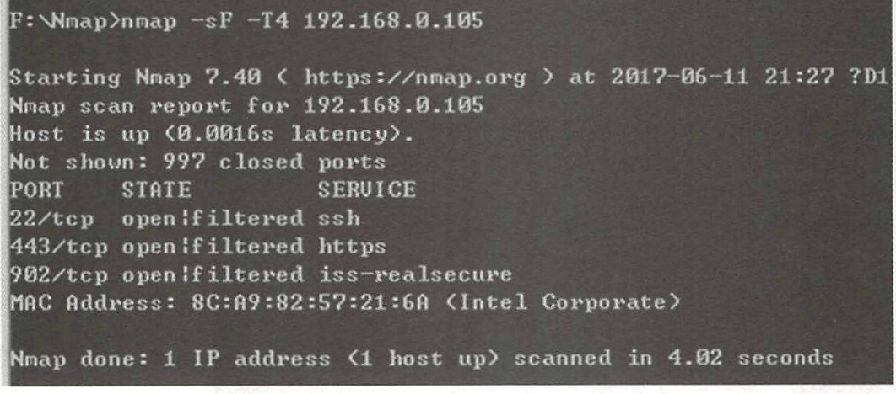
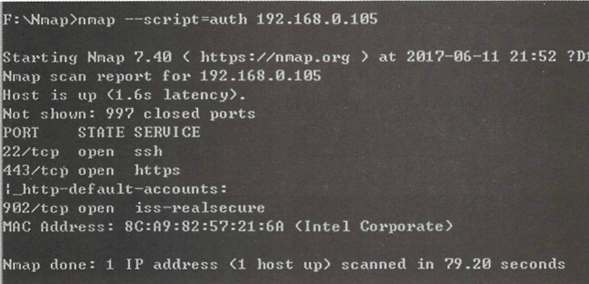
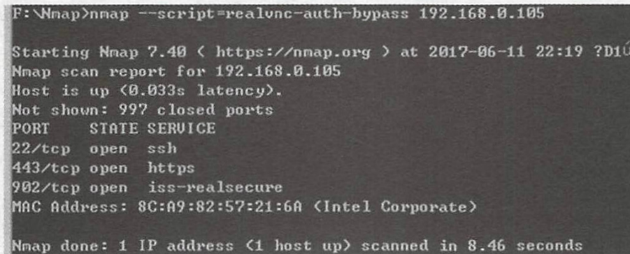

## 特点
1. 主机探测： 探测网络上的主机，如列出响应TCP和ICMP请求、 ICMP请求、 开放特别端口的主机。
2. 端口扫描：探测目标主机所开放的端口。
3. 版本检测：探测目标主机的网络服务，判断其服务名称及版本号。 系统检测 ： 探测目标主机的操作系统及网络设备的硬件特性。
4. 支持探测脚本的编写：使用Nmap的脚本引擎 CNSE）和Lua编程语言。

## 扫描参数
1. -iL：从文件中导入目标主机或目标网段。
2. -iR ： 随机选择目标主机。
3. --exclude：后面跟的主机或网段将不在扫描范围内。
4. --excludefile：导入文件中的主机或网段将不在扫描范围中 。 

与主机发现方法相关的参数如下。
1. -sL: List Scan （列表扫描），仅列举指定目标的IP，不进行主机发现。 2. -sn: Ping Scan，只进行主机发现，不进行端口扫描。
3. -Pn ： 将所有指定的主机视作己开启，跳过主机发现的过程。
4. -PS/PA/PU/PY[portlist]：使用TCP SYN/ACK或SCTP INIT/ECHO方式来发现。 
5. -PE/PP/PM： 使用ICMP echo 、 timestamp 、 netmask请求包发现主机。 6. -PO[protocollist]：使用IP协议包探测对方主机是否开启。 
7. -n/-R: -n表示不进行DNS解析；
8. －R表示总是进行DNS解析。 
9. --dns-servers <serv 1 [,serv2],...>： 指定DNS服务器。 
10. --system-dns：指定使用系统的DNS服务器。
11. --traceroute：追踪每个路由节点。 

与常见的端口扫描方法相关的参数如下。
1. -sS/sT/sA/sW/sM：指定使用TCP SYN/Connect()/ACK/Window/Maimon scans 的方式对目标主机进行扫描。
2. -sU： 指定使用UDP扫描的方式确定目标主机的UDP端口状况。
3. -sN/sF/sX：指定使用TCP Null/FIN/Xmas scans秘密扫描的方式协助探测对 方的TCP端口状态。
4. --scanflags <flags>: 定制TCP包的flags。
5. -sI <zombie host[:probeport]>：指定使用Idle scan的方式扫描目标主机（前提 是需要找到合适的zombie host ） 。
6. -sY/sZ:使用SCTP INIT/COOKIE-ECHO扫描SCTP协议端口的开放情况。
7. -sO：使用IP protocol扫描确定目标机支持的协议类型。
8. -b<FTP relay host>：使用FTP bounce scan扫描方式。

跟端口参数与扫描顺序的设置相关的参数如下。
1. -p <port ranges>： 扫描指定的端口 。
2. -F: Fast mode （快速模式），仅扫描TOP 100的端口 。
3. -r ： 不进行端口随机打乱的操作(如无该参数， Nmap会将要扫描的端口以 随机顺序的方式进行扫描)
4. --top-ports <number>：扫描开放概率最高的number个端口,即1000个端口
5. --port-ratio <ratio>： 扫描指定频率以上的端口。与土述一top-ports类似，这 里以概率作为参数，概率大于一port-ratio的端口才被扫描。 显然参数必须在 O～l之间 ， 想了解具体的概率范围可以查看nmap-services文件。
    
与版本侦测相关的参数如下所示。
1. -sV： 指定让Nmap进行版本侦测 。
2. -version-intensity<level>:指定版本侦测的强度（0～9 ），默认为7.数值越高,探测出的服务越准确，但是运行时间会比较长。
3. --version-light ： 指定使用轻量级侦测方式（intensity 2 ） 。 
4. --version-all ： 尝试使用所有的probes进行侦测（intensity 9 ）。 一5. -version-trace ： 显示出详细的版本侦测过程信息。
    

```

### namp的常见用法
1. 扫描单个目标地址
```sh
nmap ip
```
获得到这个ip对应的主机的端口开放情况
2. 扫描多个目标地址 

```sh
    nmap ip1 ip2 ip3
```
对于ip不在同一个网段可以使用这个方法。
3. 扫描一个范围内的ip集
```
    nmap 192.168.0.0-100and
```
4. 扫描一个网段  
```shwll
nmap ip/netmask
```
如果目标是一个网段，则可以通过添加子网掩码的方式扫描
5. 扫描一个文件中的ip地址
```
nmap -iL txt
```
6. 扫描除某一个目标地址之外的所青目标地址
```shell
nmap 192.168.0.100/24 - exclude 192.168.0.105
```
7. 扫描除某一文件申的目标地址之外的目标地址
```
nmap 192 .168.0.100/24 -excludefile C:\Users\target.txt
```
8. 扫描某一目标地址的 21 、 22 、 23 、 80 踹口
```shell
nmap 192.168.0.100 -p 21,22,23,80
```
9. 对目标地址进行路由跟踪
```shell
nmap -t traceroute 192.168 . 0 . 105
``
10. 扫描目标地址所在 C 段的在线状况
```shell
nmap -sP 192.168 .0 .10白／ 24
```
11. 目标地址的操作系统识别
```shell
namep -O 192.168.0.2
```
12. 目标地址提供的服务版本检测
服务状态指的是开放端口运行着哪一些服务
```
nmap -sV 192.168.0.105
```
运行结果如下：


13. 探测防火墙状态
```
nmap -sF -T4 192.168.0.105
```
运行结果如下图所示



## nmap端口状态
常见的6种Nmap端口状态及其含义


## nmap脚本编写
### namp自带脚本

nmap自带的脚本存放在nmap/scripts文件架下。下面来介绍以下自带脚本的分类
### 鉴权扫描
使用--script=auth可以对目标主机或目标主机所在的网段进行应用弱口令检测。
```shell
nmap --script=auth 192.168.0.105
```
结果如下：

### 暴力破解攻击
Nmap具有暴力破解的功能，可对数据库、 SMB 、 SNMP等进行简单密码的暴力猜解
```shell
nmap --script=brute 192.168.0.105
```
结果如下：


### 扫描常见的漏洞
Nmap具备漏洞扫描的功能，可以检查 目标主机或网段是否存在常见的漏洞,而这个漏洞指的是，
```shell
nmap --script=vule 192.168.0.105
```
好奇的是，可以扫描哪些漏洞？
### 应用服务扫描
Nmap具备很多常见应用服务的扫描脚本，例如VNC服务、 MySQL服务、 Telnet服务、 Rsync服务等
```shell
nmap --script=realvnc-auth-bypass 192.168.0.105
```
结果如下图所示：


### 探测局域网内更多服务开启的情况
```shell
nmap --script=broadcast 192.168.0.105
```

### whois查询
```shell
nmap --script external baidu.com
```


```{.python .input}

```
