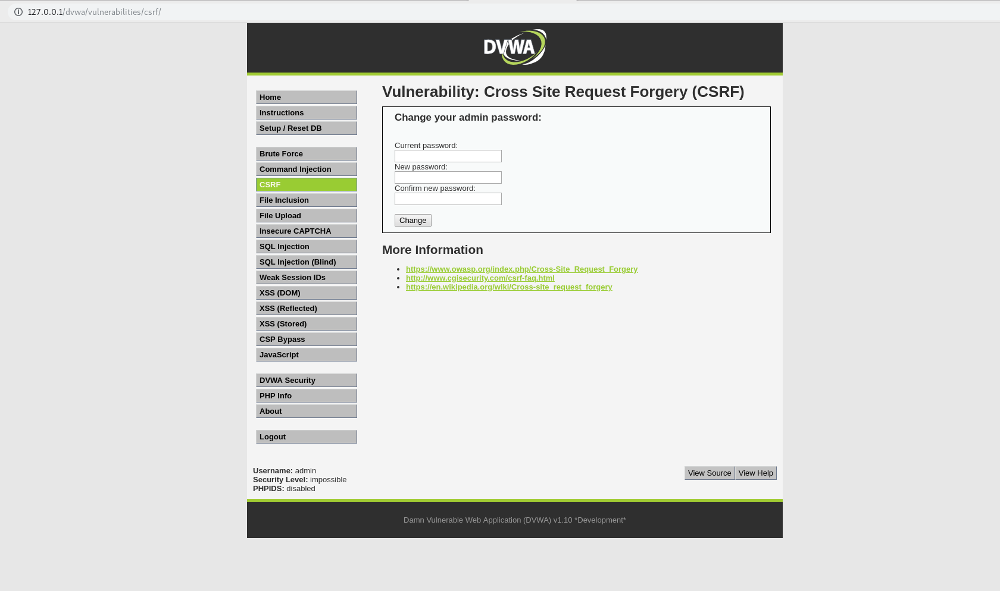
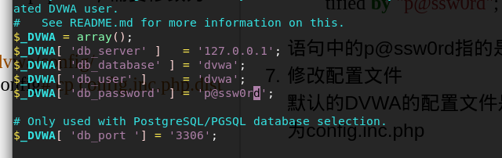

>DMWA平台可以进行常见的web测试
1. sql测试
2. xss测试
3. ...

先看成果



## 平台搭建
1. 下载源码
```shell
root@localhost# git clone https://github.com/ethicalhack3r/DVWA.git
```
2. 迁移文件  
由于使用的是linux的apache服务,为了方便起见,就直接放在apache服务默认的http文件夹下
```shell
root@bigzero:~# mv DVWA /var/www/html
root@bigzero:~# mv /var/www/html/DVWA /var/www/html/dvwa
```
3.  修改权限
```shell
root@bigzero:~# chmod -R 755 /var/www/html/dvwa
```
4.  启动mysql服务(kali自带的是10.1.26-MariaDB-1)
```shell
root@bigzero:~# /etc/init.d/mysql start
```
5. 登录mysql
```shell
root@localhost#  mysql -u root
```

6.  创建数据库、创建授权连接数据库的用户名密码：  
(mariadb新版本默认不能使用root连接数据库)：
```mysql
create database dvwa;  
grant all privileges on *.* to dvwa@127.0.0.1 identified by "p@ssw0rd";
```
语句中的p@ssw0rd指的是dvwa用户的密码

7. 修改配置文件  
 默认的DVWA的配置文件是config.inc.php.dist，需要修改为config.inc.php
 ```shell
root@bigzero:~# cd /var/www/html/dvwa/config/
root@bigzero:/var/www/html/dvwa/config# cp config.inc.php.dist config.inc.php
 ```
 编辑配置文件
 ```shell
root@bigzero:/var/www/html/dvwa/config# vi config.inc.php
 ```
 修改配置文件,改成下面这样子


8. 启动apache2
```shell
root@bigzero:~# /etc/init.d/apache2 start
```
      
 访问127.0.0.1/dvwa,成功.
 

## 用法

```{.python .input}

```
