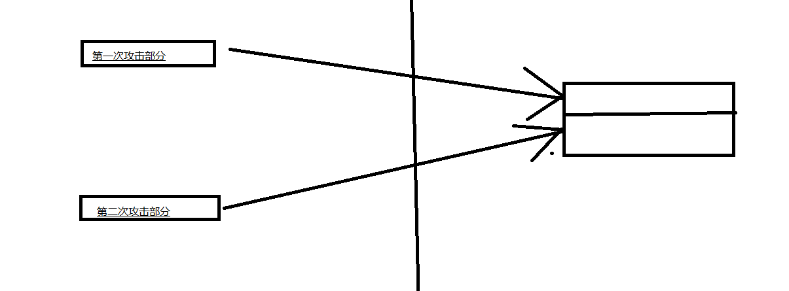
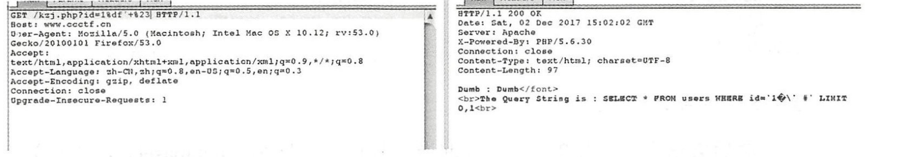
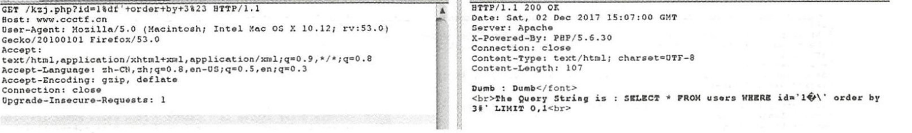
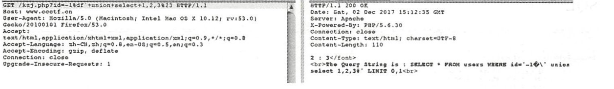
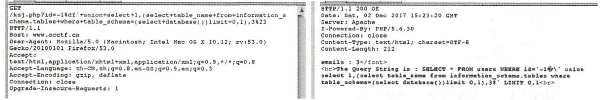
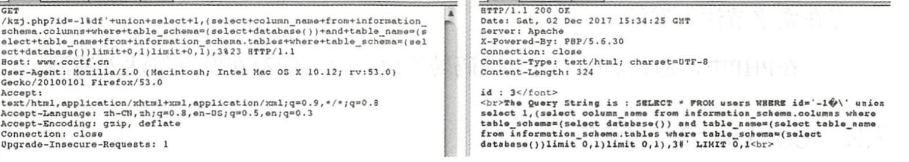

## 堆叠查询
堆叠查询就是指可以执行多条语句，多语句之间以分号隔开。即第一条语句是系统自己的语句，当系统执行完自己的sql语句的时候，就会执行第二条语句，而这条语句则是我们的注入语句。这样子数据库就执行了我们自己的sql语句。
如：

```sql
'; select if(substr(user,1,1)='r',sleep(5),1)%23
```


1. 利用堆叠注入获取数据

```sql
';select if(substr((select table_name from information_schema.tables where table_schma=database() limit 0,1),1,1)='e',sleep(5),1)%23
```


## 二次注入攻击
这个过程是比较复杂的，即整个注入过程是靠两次注入实现的。下面举几个例子。
1. 完整的select * from user语句分为两步分。第一步，注册的时候用户名写入select * from ，注册成功后。第二部分，查询用户的时候，用户名查询使用user 。这样子就会拼接成一条sql查询语句，从而实现在数据库内部实现sql查询。
2. 注册的时候，用户名填写test`,这样子在查询用户的时候。就会报错。爆出一个数据库错误。

所以二次注入攻击的完整过程是通过两次攻击一起整合到一次，从而绕过过滤。


## 宽字符注入
>针对的情况是，数据库编码方式是GBK。这样子%df+转义符等价于%df%5c.而这个是一个繁体字。

例子：如果服务器后台对输入的字符进行转义，比如：'会被转义成\\’，那么如何获取到数据库中对应的字段名？


1. 首先使用宽字符逃逸单引号包围


2. 使用order by查询当前使用的数据表的字段个数


3. 使用union确定哪个字段是可以注入的


4. 使用database()，获取到当前的数据库名称

```sql
union 1,(select database()),3
```


5. 使用database()，获取到当前的数据库名称
使用

```sql
select table_name from information_schema.tables where table_schema=(select database()) limit 0,1
```


值得注意的是这里的库名称只能使用select database()，而不能使用上面获取到的‘sql’，这是因为单引号会被转义，所以不能出现单引号。



6. 使用union获取到表中的字段

```sql
union column_name from information_schema.columns where table_schema=(select database()) and table_name=(select table_name from information_schema.tables where table_schema=(select database()) limit 0,1) limit 0,1
```





## base64注入
即，sql注入部分，先用base64进行编码，编码后再将语句发送过去。

## cookie注入
提到这点，是由于cookie中也可以存在注入点，因此从这个推广开来就可以知道，只要和数据库发生交互的就可以是存在注入点的地方。

## XFF攻击
header头部有一个X-Forwarded-for头部信息。而这个头部信息代表用户真实的ip地址。通过修改这个值可以伪造用户的客户端ip头部，毕竟我们需要知道，层与层之间是不能够进行通信的，否则就会违背TCP/IP协议de
