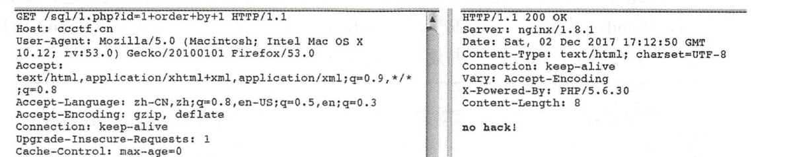
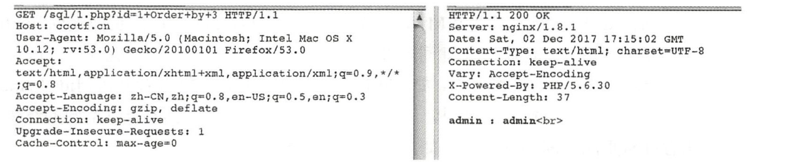
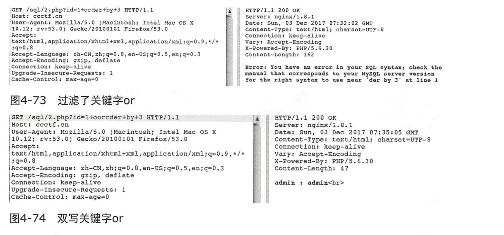

## 大小写绕过
由于前端可能对关键字段如amd select union这些sql字段进行了过滤，所以如果上传了这些单词可定是不能通过过滤的，但是php，java，python这些都是区分大小写的高级语言。而sql是不区分大小写的。因此，打乱了某个字段的大小写，也就是可以变相绕过后台的过滤，从而直接到达数据库。
举例：当order被过滤的时候，使用Order可以跳过过滤。
1. 选择合适的大小写。如order被过滤，则使用Order

查询出来一共有三个字段。

2. 选择合适的大小写Union，从而跳过union字段的过滤。从而获取到数据。

## 双写绕过注入
当前台不采用匹配过滤，而采用匹配删除的情况来使用的时候。比如and就会被删除and，那么则使用anand.这样子只有被过滤了才算成功注入。即从anand中删除and。变成了另外一个and。
举例，过滤了关键词or。

## 编码绕过注入

