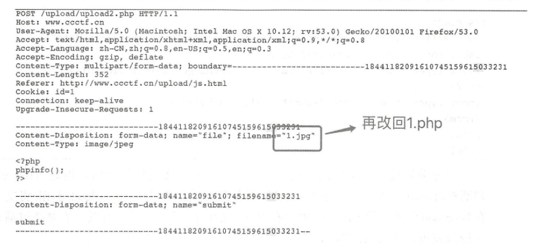

>文件上传一般是指，网站中如果存在web文件上传漏洞，那么那么恶意用户就可以利用文件上传漏洞将可执行脚本程序上传到服务器中，获得网站的权限用户可以通过上传恶意脚本，从而控制整个网站。这个而已脚本被称为webshell。也就是网页后门。也就是文件上传攻击指的是，通过上传漏洞将webshell上传到服务器，从而开启一个网站后门。

## JS 检测绕过攻击
即绕过前台的js检测文件后缀名：
1. 使用浏览器的插件，删除检测文件后缀的JS代码， 然后上传文件即可绕过。即通过前台浏览器控制台删除触发检查的函数。
2. 先将文件改成允许上传的后缀名，其次发送完上传的报文后，抓包修改文件名。

## 文件后缀绕过攻击
即将文件后缀设置成1.php.xxxx。在Apache的解析顺序中，是从右到左开始解析文件后缀的，如果最右侧的扩展 名不可识别，就继续往左判断。
## 文件类型绕过攻击
如果服务器是通过content-type来对文件进行判定的，那么我们就可以通过抓包修改content-type从而实现越过服务器过滤。

## 文件截断绕过攻击
截断类型:PHP%00截断
截断原理：由于00代表结束符，所以会把00后面的所有字符删除。
截断条件： PHP版本小于5.3.4 , PHP的magic_quotes_gpc为OFF状态。
如：如果需要上传jieduan.php那么我们只要上传jieduan.php%00.jpg,那么后台php运行的时候就会自动截断%00后面的字符串。就只剩下jieduan.php。成功上传。

