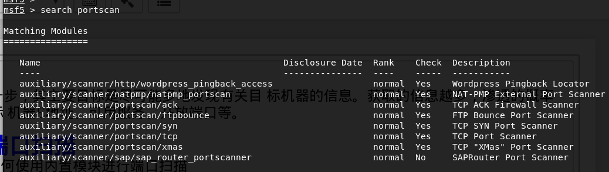
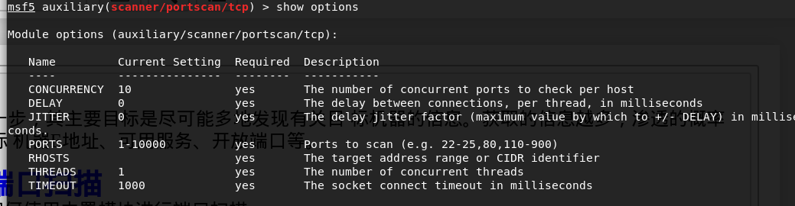
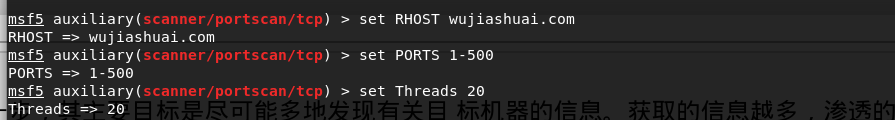
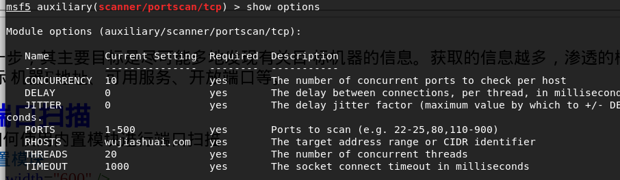
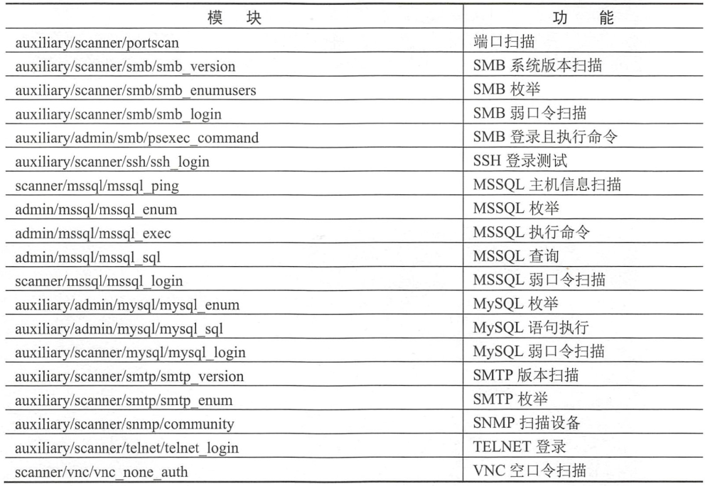

## 主机扫描的目的
扫描和收集信息是渗透测试中的第一步，其主要目标是尽可能多地发现有关目 标机器的信息。获取的信息越多，渗透的概率就越大。该步骤的主要关注点是目标 机器E地址、可用服务、开放端口等。

## 使用辅助模块进行端口扫描
辅助模块是Metasploit 的内置模块,如何使用内置模块进行端口扫描
1. search postscan查看可以扫描的内置模块

2. 选择其中的一个扫描模块

3. 查看使用这个模块,可以填写哪些选项

4. 填完这些选项

5. 查看选项与之前有什么不同

6. 运行这个模块

## 使用辅助模块进行服务扫描

使用方法与使用辅助模块进行端口扫描一样,这里就介绍一下不同模块的用处就阔以了.

## 在Metasploit中使用 Nmap 扫描

