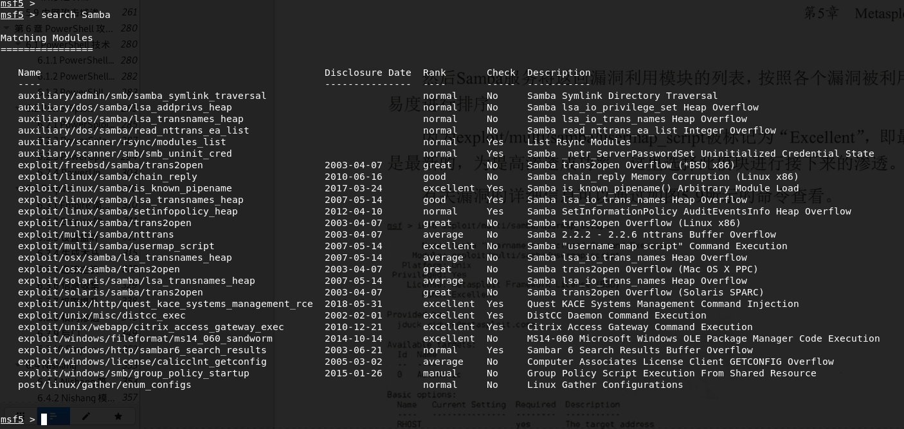
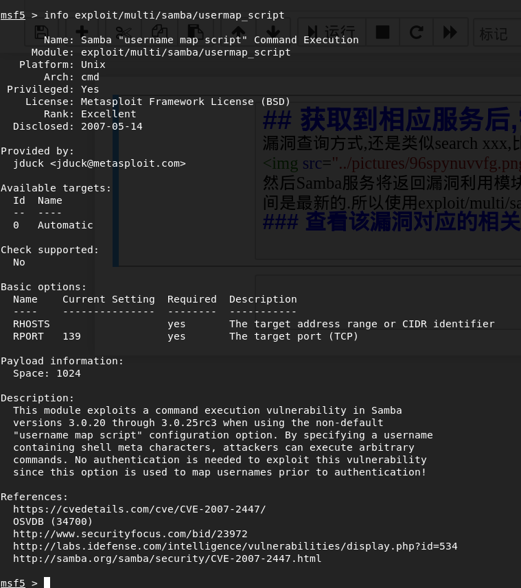

## 获取到相应服务后,需要查找漏洞
漏洞查询方式,还是类似search xxx,比如需要查询Samba有什么漏洞,那么我们只需要输入search Samba

然后Samba服务将返回漏洞利用模块的列表,按照各个漏洞被利用成功的相对难易度进行排序。Excellent表示的是最杰出而且时间是最新的.所以使用exploit/multi/samba/usermap_script.为提 高渗透成功率,这里选择此模块进行接下来的渗透 。
### 查看该漏洞对应的相关信息

