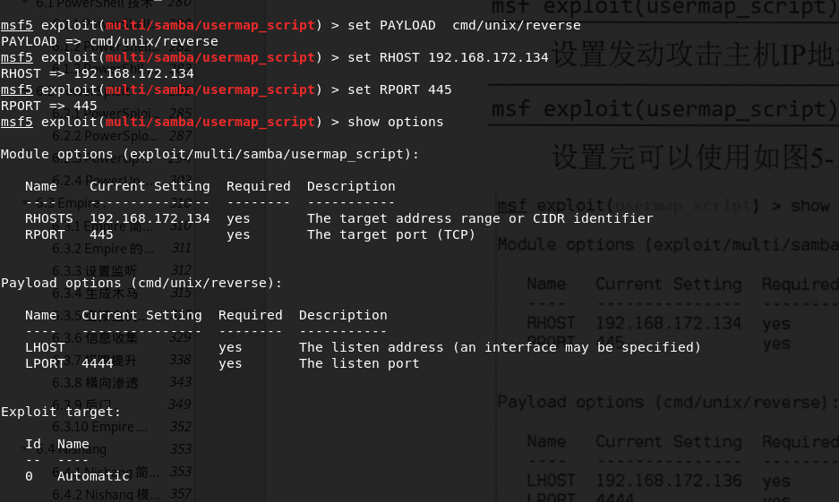
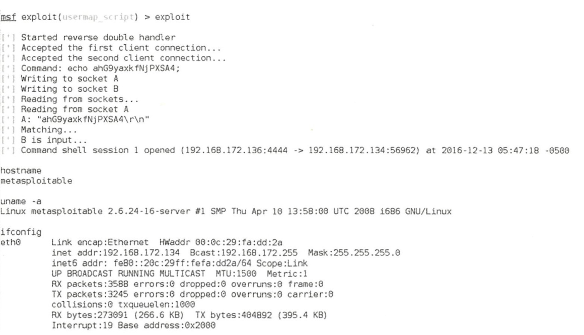

## 获取到相应服务后,需要查找漏洞
漏洞查询方式,还是类似search xxx,比如需要查询Samba有什么漏洞,那么我们只需要输入search Samba

然后Samba服务将返回漏洞利用模块的列表,按照各个漏洞被利用成功的相对难易度进行排序。Excellent表示的是最杰出而且时间是最新的.所以使用exploit/multi/samba/usermap_script.为提 高渗透成功率,这里选择此模块进行接下来的渗透 。
### 查看该漏洞对应的相关信息


## 设置选项
如果是linux系统则一定要选择paypload


设置完所有参数变量后 ,输入攻击命令exploit或者run.MSF 发动 攻击成功后 会获取目标主机的 Shell ,为了验证该 Shell是目标主机的,可以查询主机名、用户名和 IP地址, 并与目标主机进行对比,


攻击成功后,可以看到在攻击机和目标机之间会建立 一 个 Shell 连接,渗透Windows 系统的过程类似, 唯一的差别 是选择 的漏洞利用 模块和攻击载荷模块不 一样 。

```{.python .input}

```
