#  网络工程部署与实施综合实践(Day1)  
>网络部署实施课程的第一天，实现的是基于SDvpn的隧道之间相互通信。

网络拓扑：
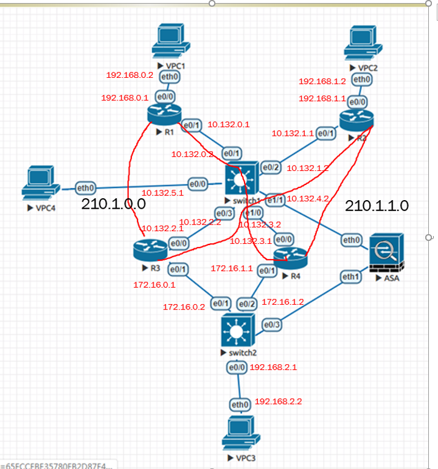
红笔标出的IP是各机器端口的IP
红笔画的是隧道的创建以及其网段
## 网络规划与设计

本质就是使用IP sec使得外网终端能够与总部内网进行通信；使用DMvpn技术使得，分部内网能够与总部进行通信；使用EIGRP使得不同内网能够互相通信

## 网络部署与实施
配置路由器与交换机端口的IP  
R1
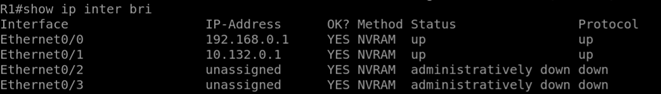

R2  
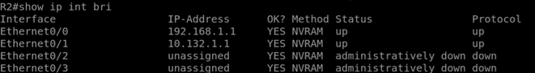
R3  
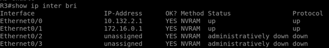
R4  
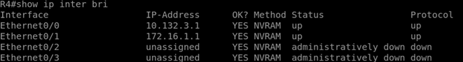
交换机SW1  
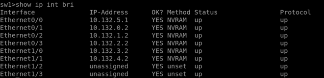
交换机SW2  
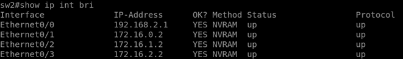

防火墙  
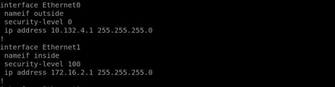
## 建立隧道
R1建立隧道  
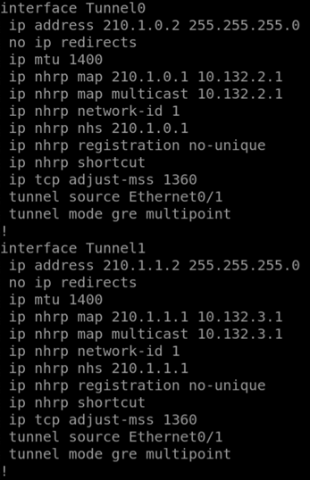
R2的隧道建立  
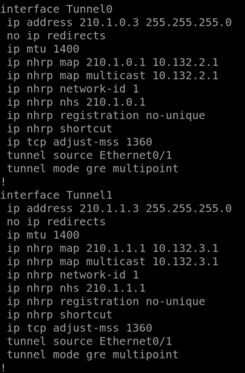
 
R3的隧道建立：
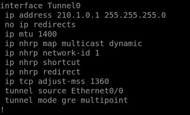
R4的隧道建立
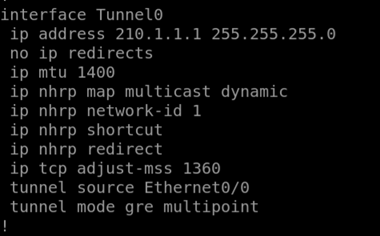
建立隧道的结果：
R1
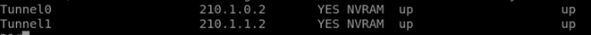
R2
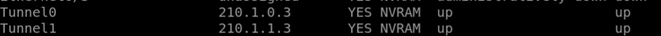
R3
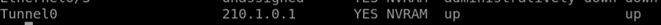
R4

## 配置ERGRP协议
R1
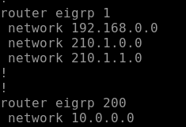
R2
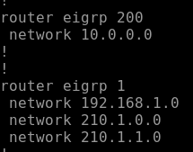
R3
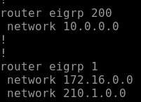
R4
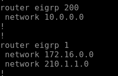
## 配置IP sec协议
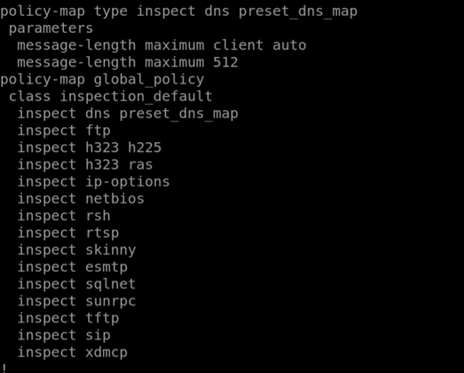


```{.python .input}

```
